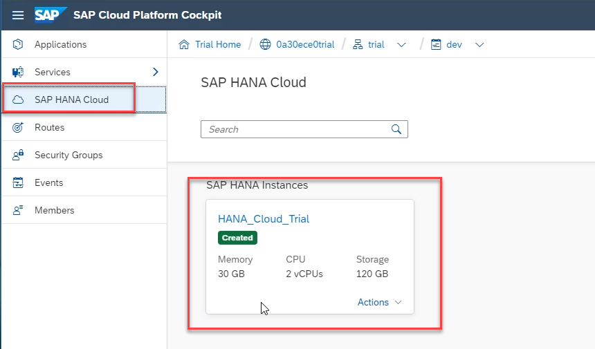
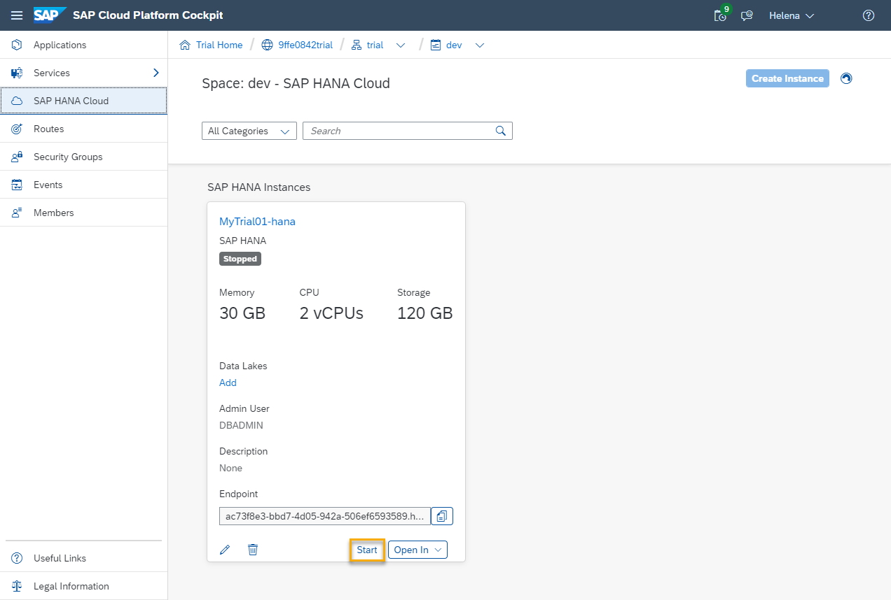
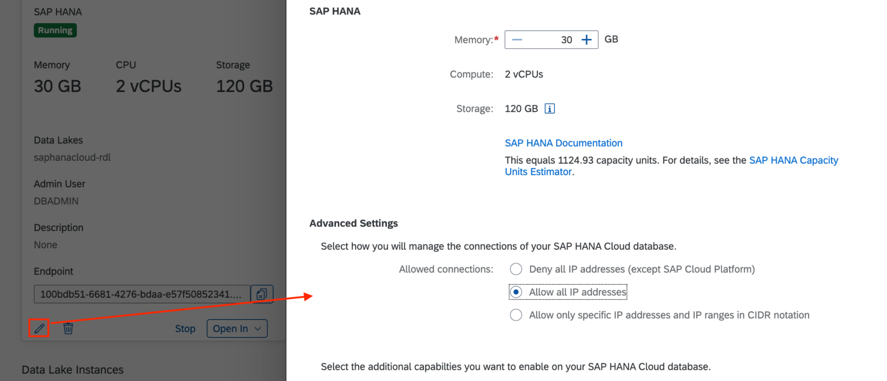
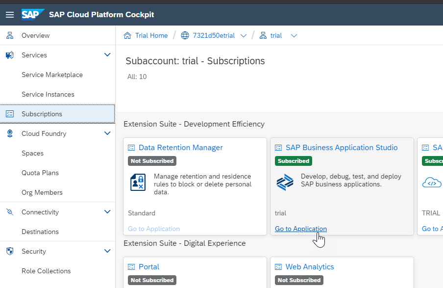
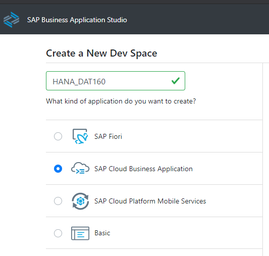
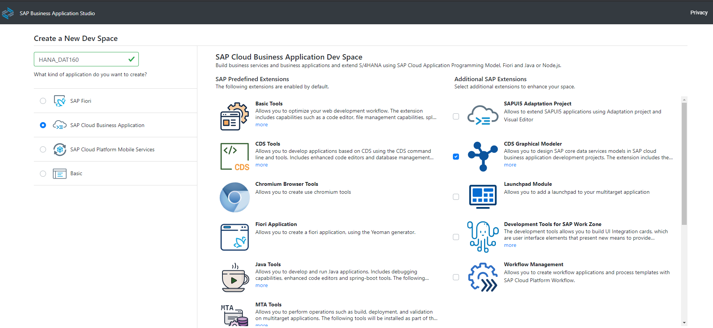
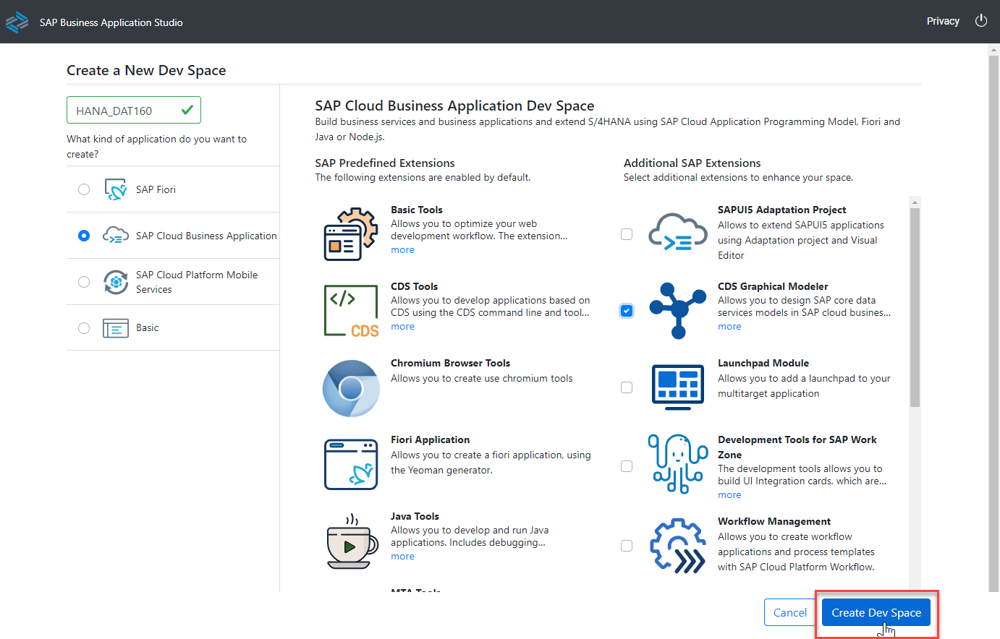
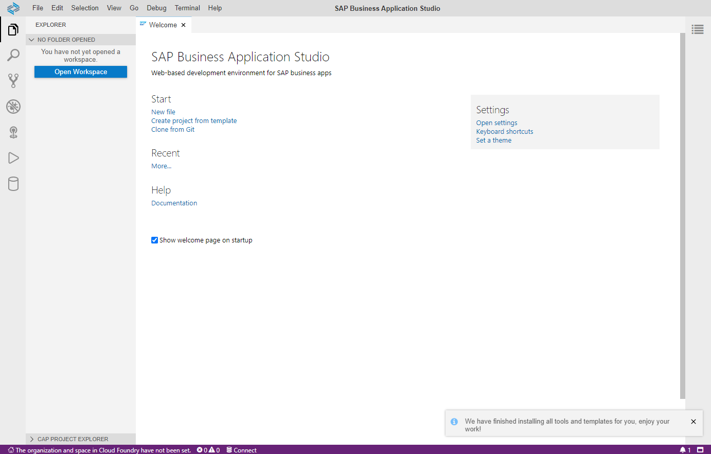
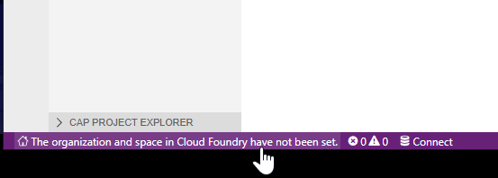
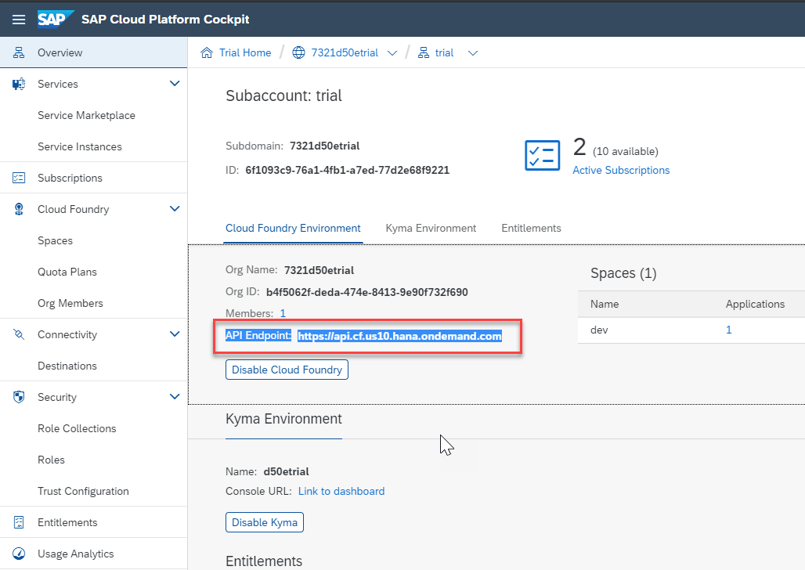

# Getting Started

In this exercise, you will perform the basic setup to get a SAP Cloud Application Programming Model (CAP) project created and ready for further development.

## Is HANA running?

In the trial landscape the HANA instance stops each night. Therefore the first thing we need to do is make sure your HANA instance is running.

1. From the SAP Cloud Platform entry page, click **Subaccounts** and then the tile for your Subaccount named **trial**
 

2. In the left side menu choose **SAP HANA Cloud**. You should see your instance details displayed. If not, please return to the [Requirements](../../README.md#Requirements) and follow the steps for "Create an instance of the SAP HANA Cloud in your trial account" 

3. If your instance is stopped, the status on the top of the tile will be updated and the button at the bottom will change to **Start**.

4. To restart the instance, simply click on the **Start** button. It takes a few minutes, but you can see the status of your instance at the top. You do NOT have to wait while your HANA instance restarts. You can continue on with the subsequent steps and check back on the status in a few minutes. 

5. Double check, using the edit icon to access the instance's settings, that the "Allow all IP addresses" option is selected for the Whitelisted connections setting.

## Creating Business Application Studio Dev Space

Dev spaces are like isolated virtual machines in the cloud that can be quickly spun-up. Each dev space type contains tailored tools and pre-installed run-times for a target scenario such as SAP Fiori or mobile development. This simplifies and saves time in setting up the development environment as there’s no need to install anything or upgrade; letting developers focus on their business domain, anytime, anywhere.

1. Go to your SAP Cloud Platform subaccount and click the **Subscriptions** option. 

2. Locate the **SAP Business Application Studio** tile and click **Go to Application** 

3. Choose **Create Dev Space**. Please **NOTE**: In the SAP Cloud Platform trial you are limited to only two Dev Spaces and only one can be active at a time. If you have performed other workshops, you might already have reached your maximum. In that case you might have to delete one of the other dev spaces in order to continue with this workshop.  

4. Enter **HANA_DAT160** for your dev space name and choose **SAP Cloud Business Application** as the kind of application you are creating. 

5. The Dev space will automatically be configured with the most common tools you need for the type of application you choose. However you can also choose additional, optional extensions.  For this workshop we would recommend also choosing **CDS Graphical Modeler**. 

6. Once all selections are completed, press **Create Dev Space** 

7. The Dev Space will then begin starting and the process will take a minute or so as your cloud environment is being created 

8. Once the Dev Space reaches the green status of **RUNNING**, you can click on the name of the Dev Space and it will load into the editor within your browser 

9. You'll be redirected to your newly created SAP Business Application Studio Dev Space. We recommend you bookmark this URL so it's easier for you to access this dev space of your SAP Business Application Studio in the future  

## Configuring Business Application Studio Dev Space

Before we create our SAP Cloud Application Programming Model project, we want to do a few more one-time configuration steps to prepare the Dev Space

1. In the bottom left of the Business Application Studio you will see a message that your Organization and Space are not set yet. Click this message to begin supplying your trial connection details 

2. The command window will then open at the top of the Business Application Studio. The first input will prompt you for the API endpoint 

3. The default value proposed is likely the correct value, but if you need to confirm; the value can be found in the SAP Cloud Platform Cockpit at the Subaccount level  

4. Press **Enter** to confirm your input of the API endpoint. The next input field will ask you for the email address you used to create your SAP Cloud Platform trial account  

5. The next input will ask you for your SAP Cloud Platform trial account password  

6. The next input will ask you for your Organization. In most situations you will have a single choice. But like the API endpoint earlier, if you need to confirm the correct value it will be displayed in the top navigation of the SAP Cloud Platform Cockpit  

7. The final input will ask you for your Space. If you choose the endpoint API and Organization correctly, then you should have a single option of **dev**  

8. Upon completion of all the inputs, you should see that the Organization and Space have been set and you will see the values in the Targeting... dialog at the bottom left of the Business Application Studio  

## Summary

Your HANA instance should be running and you've created a Dev Space and configured it for your needs in the Business Application Studio. You are now ready to begin development.

Continue to - [Exercise 1 - Create CAP Project](../ex1/README.md)
