# Exercise 1 - Create CAP Project

[](/code/)

In this exercise, we will create...

## Exercise 1.1 Create Project From Template

After completing these steps you will have created...

1. Click **Create project from template** </br>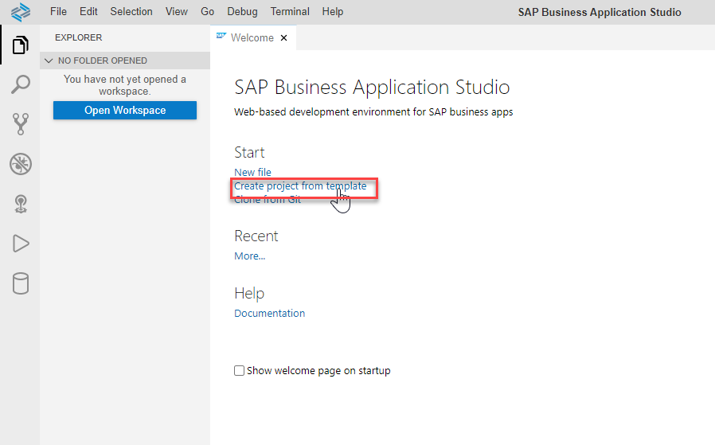

2. Choose **@sap/cap Project** as the template. Keep the target folder path at the default value. Press **Next**</br>

3. </br>

4. </br>

5. </br>

## Exercise 1.2 Adjust package.json

After completing these steps you will have...

1. </br>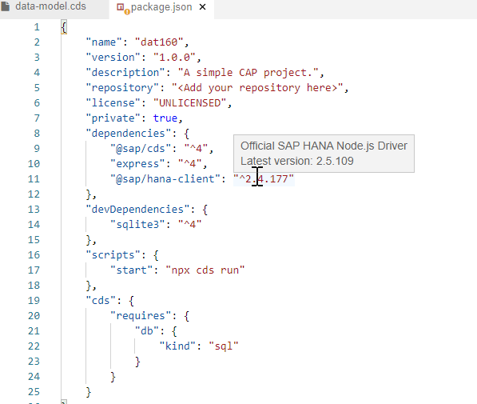

2. cds section of package.json add hana.deploy-format

```json
"cds": {
        "hana": {
            "deploy-format": "hdbtable"
        },
        "requires": {
            "db": {
                "kind": "hana"
            }
        }
    }  
```

3. scripts section

```json
    "scripts": {
        "hana": "cds deploy --to hana:dat160 --auto-undeploy",
        "start": "cds run",
        "build": "cds build/all --clean"
    },
```

4. Complete package.json</br>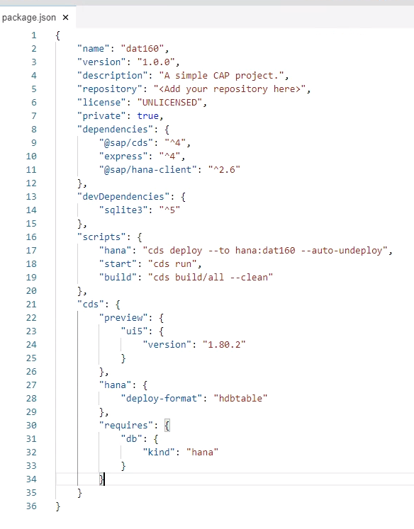

5. New terminal</br>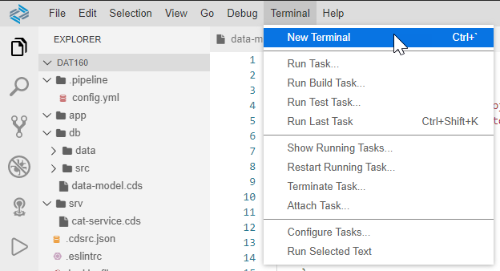

6. npm install

```shell
npm install
```

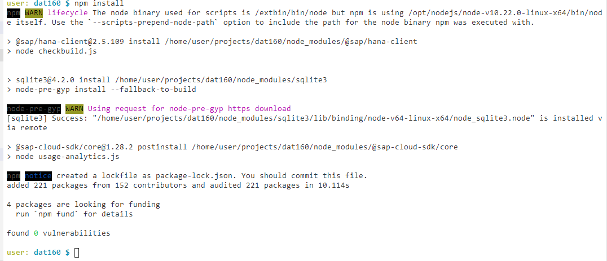

## Exercise 1.3 Build Sample Project Into HANA

After completing these steps you will have created...

1. Run build command

```shell
npm run build
```

2. What build did</br>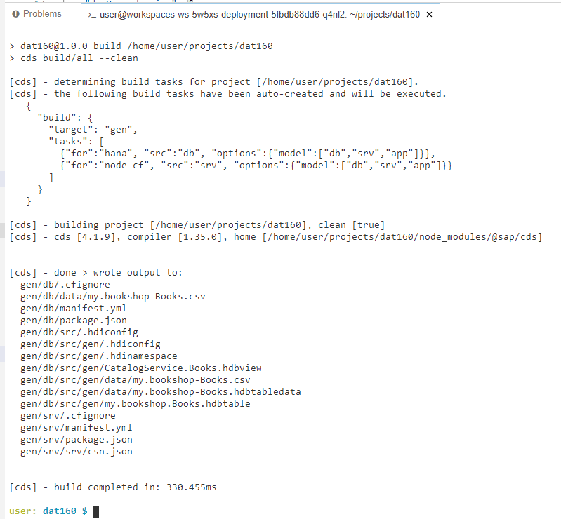

3. gen folder</br>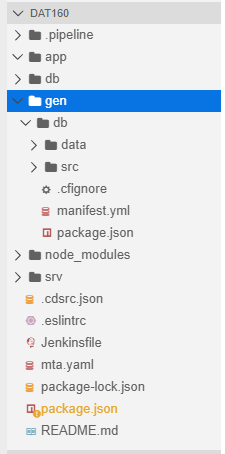

4. Run deploy to

```shell
npm run hana
```

5. Results of deploy to</br>

6. Install hana-cli

```shell
npm install -g hana-cli
```


7. hana-cli uses default-env.json created by the cds deploy to command. Can use that to connect to the HANA DB </br>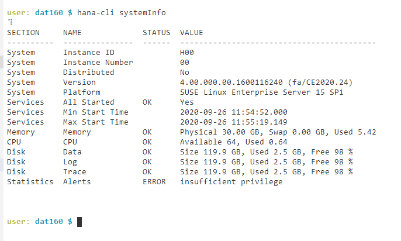

8. Or to the specific HDI container that was created for the CAP project</br>

9. Open Database Explorer</br>

10. Database Explorer initially empty</br>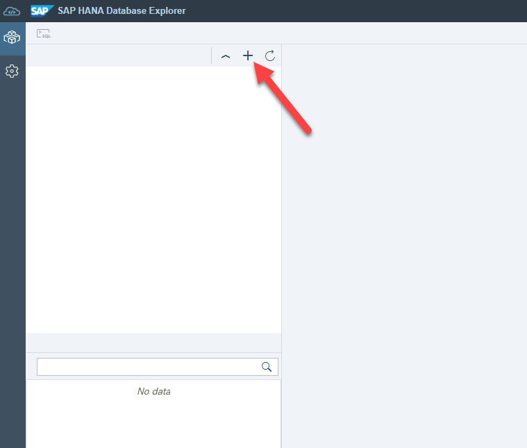

11. Add Database</br>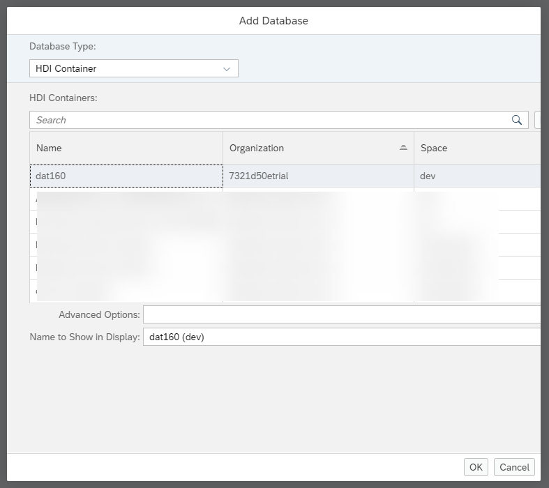

12. One sample table</br>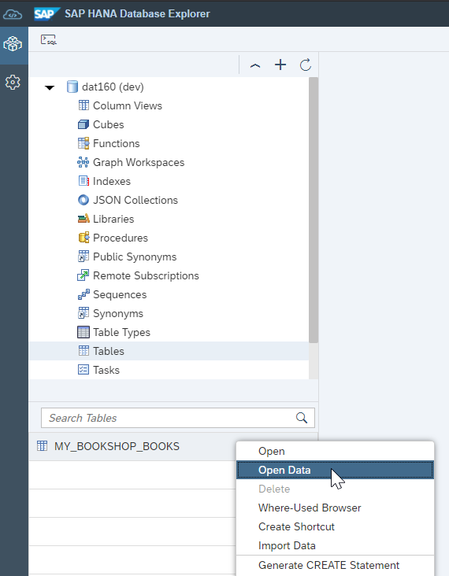

13. View Data</br>

## Summary

You've now ...

Continue to - [Exercise 2 - Building the Data Model](../ex2/README.md)

