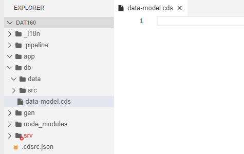
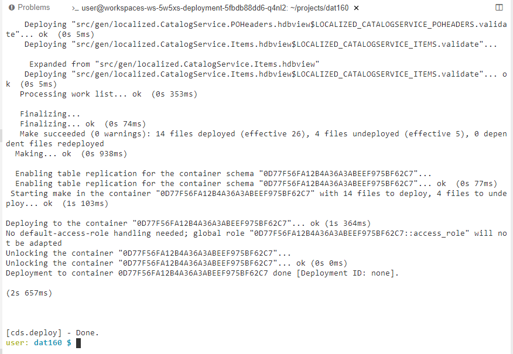
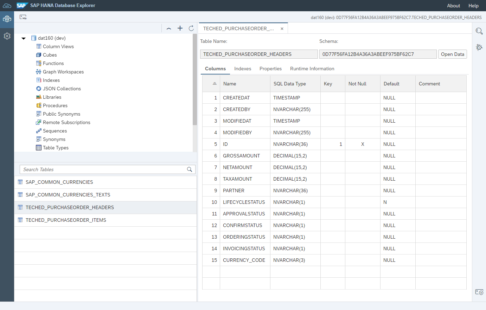
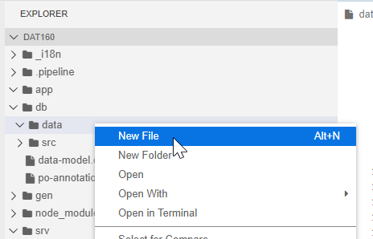
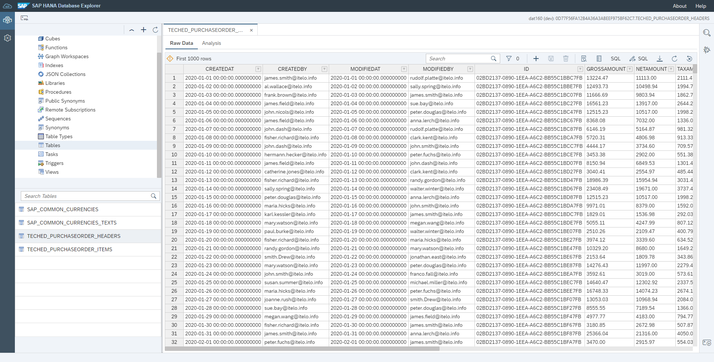

# Exercise 2 - Building the Data Model

In this exercise, we will create...

## Exercise 2.1 Cleanup and Preparations for New Data Model

After completing these steps you will have created...

1. Remove sample service entity</br>

2. Delete sample csv</br>

3. Add _i18n/i18n.properties file</br></br></br>
4. Add descriptions to i18n.properties

```properties
po_id=Purchase Order ID
po_items=Purchase Order Items
poService=Purchase Order
poServices==Purchase Orders
buyerService=Buyer Details
userService=User Details
currencyService=Currency Code
CreateBy=Created By
CreateAt=Created Date
ChangedBy=Last Updated By
ChangedAt=Last Update Date
currency=Currency
partner_id=Partner ID
quantity=Quantity
quantityUnit=Quantity Unit
product=Product
products=Products
notes=Notes
grossAmount=Gross Amount
netAmount=Net Amount
taxAmount=Tax Amount
lifecycle=Lifecycle Status
approval=Approval Status
confirmation=Confirmation Status
ordering=Ordering Status
invoicing=Invoicing Status
note=Note
deliveryDate=Delivery Date
partnerId=Partner ID
partnerRole=Partner Role - Customer or Supplier
email=Email Address
phone=Phone Number
fax=Fax Number
web=Web Site Address
address=Address Association
company=Company Name
legal=Legal Form
building=Building Number
city=City
country=Country
region=Region Otherwise Known as State in some countries
addressType=Address Type
postalCode=Postal Code
street=Street
fname=Given Name
lname=Family Name
mname=Middel Name
userId=User Id
currCode=Currency Code
currDesc=Currency Description
internal_id=Internal ID
details=Details
code1=Country Code
alpha3=Three Character Country Code
iso=ISO 3166-2 Code
region=Region
sub_region=Sub Region
region_code=Region Code
sub_region_code=Sub Region Code
country=Country
sub_code=Subdivision Code
name=Subdivision Name
type=Subdivision Type
poServices=Purchase Order Services
gender=Gender
latitude=Geo Latitude
longitude=Geo Longitude
validFrom=Valid From
validTo=Valid To
addressId=Address Internal ID
employeeId=Employee Internal ID
initials=Initials
sex=Gender
language=Primary Spoken Language
phoneNumber=Primary Phone Number
email=Email Address
loginName=Login Username
accountNumber=Bank Account Number
salaryAmount=Salary Amount
bankId=Bank ID
bankName=Bank Name
employeePicUrl=Employee Picture URL
businessParnters=Business Partners
typeCode=Type Code
category=Product Category
name=Product Name
desc=Product Description
supplier=Supplier
weightMeasure=Weight Measure
weightUnit=Weight Unit
price=Price
picUrl=Product Picture URL
width=Width
depth=Depth
height=Height
dimensionUnit=Dimension Unit
addrService=Address
addrServices=Addresses
userService=User
userServices=Users
user_id=User ID
productImage=Product Image
productImageType=Product Image Typ
```

5. db/data-model.cds - clear content </br>

## Exercise 2.2 Create Data Model

After completing these steps you will have...

1. Return to the **/db/data-model.cds** file. This is where we will build our complete application data model

2. We start with a **using** block. This is how we import existing types and other resuable parts from other **cds** files, including from SAP standard delivered ones. Here were using the @sap/cds/common which contains valuable enterprise reuse concepts like currency conversion, generated GUID keys, etc.  This module is stored in the public npm repostory as part of the @sap/cds module and needs no special configuration to load or reuse it.

```cds
using {
    Currency,
    managed,
    sap,
    cuid
} from '@sap/cds/common';
```

3. extend Currencies

```cds
extend sap.common.Currencies with {
    numcode  : Integer;
    exponent : Integer; //> e.g. 2 --> 1 Dollar = 10^2 Cent
    minor    : String; //> e.g. 'Cent'
}
```

4. Context teched.common

```cds
context teched.common {

}
```

5. Simple types

```cds
    type BusinessKey : String(10);
    type SDate : DateTime;
```

6. Enum type

```cds
    @assert.range : true
    type StatusT : String(1) enum {
        New        = 'N';
        Incomplete = 'I';
        Approved   = 'A';
        Rejected   = 'R';
        Confirmed  = 'C';
        Saved      = 'S';
        Delivered  = 'D';
        Cancelled  = 'X';
    }
```

7. Amount type

```cds
    type AmountT : Decimal(15, 2)@(
        Semantics.amount.currencyCode : 'CURRENCY_code',
        sap.unit                      : 'CURRENCY_code'
    );

    abstract entity Amount {
        currency    : Currency;
        grossAmount : AmountT;
        netAmount   : AmountT;
        taxAmount   : AmountT;
    }

    annotate Amount with {
        grossAmount @(title : '{i18n>grossAmount}');
        netAmount   @(title : '{i18n>netAmount}');
        taxAmount   @(title : '{i18n>taxAmount}');
    }
```

8. Quantity Type

```cds
    type QuantityT : Decimal(13, 3)@(title : '{i18n>quantity}');
    type UnitT : String(3)@title : '{i18n>quantityUnit}';

    abstract entity Quantity {
        quantity     : QuantityT;
        quantityUnit : UnitT;
    }
```

9. Purchase Order Headers

```cds
context teched.PurchaseOrder {
    entity Headers : managed, cuid, teched.common.Amount {
        @cascade : {all}
        item            : Composition of many Items
                              on item.poHeader = $self;
        noteId          : teched.common.BusinessKey null;
        partner         : UUID;
        lifecycleStatus : teched.common.StatusT default 'N';
        approvalStatus  : teched.common.StatusT;
        confirmStatus   : teched.common.StatusT;
        orderingStatus  : teched.common.StatusT;
        invoicingStatus : teched.common.StatusT;
    }
}
```

10. Purchase Order Items

```cds
    entity Items : cuid, teched.common.Amount, teched.common.Quantity {
        poHeader     : Association to Headers;
        product      : teched.common.BusinessKey;
        noteId       : teched.common.BusinessKey null;
        deliveryDate : teched.common.SDate;
    }
```

11. The complete file should look like

```cds
using {
    Currency,
    managed,
    sap,
    cuid
} from '@sap/cds/common';

extend sap.common.Currencies with {
    numcode  : Integer;
    exponent : Integer; //> e.g. 2 --> 1 Dollar = 10^2 Cent
    minor    : String; //> e.g. 'Cent'
}

context teched.common {
    type BusinessKey : String(10);
    type SDate : DateTime;

    @assert.range : true
    type StatusT : String(1) enum {
        New        = 'N';
        Incomplete = 'I';
        Approved   = 'A';
        Rejected   = 'R';
        Confirmed  = 'C';
        Saved      = 'S';
        Delivered  = 'D';
        Cancelled  = 'X';
    }

    type AmountT : Decimal(15, 2)@(
        Semantics.amount.currencyCode : 'CURRENCY_code',
        sap.unit                      : 'CURRENCY_code'
    );

    abstract entity Amount {
        currency    : Currency;
        grossAmount : AmountT;
        netAmount   : AmountT;
        taxAmount   : AmountT;
    }

    annotate Amount with {
        grossAmount @(title : '{i18n>grossAmount}');
        netAmount   @(title : '{i18n>netAmount}');
        taxAmount   @(title : '{i18n>taxAmount}');
    }

    type QuantityT : Decimal(13, 3)@(title : '{i18n>quantity}');
    type UnitT : String(3)@title : '{i18n>quantityUnit}';

    abstract entity Quantity {
        quantity     : QuantityT;
        quantityUnit : UnitT;
    }
}

context teched.PurchaseOrder {
    entity Headers : managed, cuid, teched.common.Amount {
        @cascade : {all}
        item            : Composition of many Items
                              on item.poHeader = $self;
        noteId          : teched.common.BusinessKey null;
        partner         : UUID;
        lifecycleStatus : teched.common.StatusT default 'N';
        approvalStatus  : teched.common.StatusT;
        confirmStatus   : teched.common.StatusT;
        orderingStatus  : teched.common.StatusT;
        invoicingStatus : teched.common.StatusT;
    }

    entity Items : cuid, teched.common.Amount, teched.common.Quantity {
        poHeader     : Association to Headers;
        product      : teched.common.BusinessKey;
        noteId       : teched.common.BusinessKey null;
        deliveryDate : teched.common.SDate;
    }
}
```

12. Annotate POs - create a new file in the **/db** folder named **po-annotations.cds**

```cds
using teched.PurchaseOrder as PO from './data-model';

annotate PO.Headers with @(
    title       : '{i18n>poService}',
    description : '{i18n>poService}'
) {
    ID              @(
        title       : '{i18n>po_id}',
        description : '{i18n>po_id}',
    );

    items           @(
        title       : '{i18n>po_items}',
        description : '{i18n>po_items}'
    );

    partner         @(
        title            : '{i18n>partner_id}',
        description      : '{i18n>partner_id}'
    );

    lifecycleStatus @(
        title               : '{i18n>lifecycle}',
        description         : '{i18n>lifecycle}',
        Common.FieldControl : #ReadOnly
    );

    approvalStatus  @(
        title               : '{i18n>approval}',
        description         : '{i18n>approval}',
        Common.FieldControl : #ReadOnly
    );

    confirmStatus   @(
        title               : '{i18n>confirmation}',
        description         : '{i18n>confirmation}',
        Common.FieldControl : #ReadOnly
    );

    orderingStatus  @(
        title               : '{i18n>ordering}',
        description         : '{i18n>ordering}',
        Common.FieldControl : #ReadOnly
    );

    invoicingStatus @(
        title               : '{i18n>invoicing}',
        description         : '{i18n>invoicing}',
        Common.FieldControl : #ReadOnly
    );
};

annotate Items with {
    ID           @(
        title       : '{i18n>internal_id}',
        description : '{i18n>internal_id}',
    );

    product      @(
        title               : '{i18n>product}',
        description         : '{i18n>product}',
        Common.FieldControl : #Mandatory,
        Search.defaultSearchElement
    );

    deliveryDate @(
        title       : '{i18n>deliveryDate}',
        description : '{i18n>deliveryDate}'
    )
}
```

13. Build ```npm run build```.  Deploy ```npm run hana``` </br>

14. Check Results </br>

## Exercise 2.3 Load Initial Data From CSV

After completing these steps you will have...

1. In the /db/data folder we will now create CSV files to load initial data </br>

2. Add currencies /db/data/sap.common-Currencies.csv

```csv
code;symbol;name;descr;numcode;minor;exponent
EUR;€;Euro;European Euro;978;Cent;2
USD;$;US Dollar;United States Dollar;840;Cent;2
CAD;$;Canadian Dollar;Canadian Dollar;124;Cent;2
AUD;$;Australian Dollar;Canadian Dollar;036;Cent;2
GBP;£;British Pound;Great Britain Pound;826;Penny;2
ILS;₪;Shekel;Israeli New Shekel;376;Agorat;2
INR;₹;Rupee;Indian Rupee;356;Paise;2
QAR;﷼;Riyal;Katar Riyal;356;Dirham;2
SAR;﷼;Riyal;Saudi Riyal;682;Halala;2
JPY;¥;Yen;Japanese Yen;392;Sen;2
CNY;¥;Yuan;Chinese Yuan Renminbi;156;Jiao;1
```

3. Add currencies texts /db/data/sap.common-Currencies_texts.csv

```csv
code;locale;name;descr
EUR;de;Euro;European Euro
USD;de;US-Dollar;United States Dollar
CAD;de;Kanadischer Dollar;Kanadischer Dollar
AUD;de;Australischer Dollar;Australischer Dollar
GBP;de;Pfund;Britische Pfund
ILS;de;Schekel;Israelische Schekel
EUR;fr;euro;de la Zone euro
USD;fr;dollar;dollar des États-Unis
CAD;fr;dollar canadien;dollar canadien
AUD;fr;dollar australien;dollar australien
GBP;fr;livre sterling;pound sterling
ILS;fr;Shekel;shekel israelien
```

4. Add PO Headers /db/data/teched.PurchaseOrder-Headers.csv - lots of data, copy from [teched.PurchaseOrder-Headers.csv](code/db/data/teched.PurchaseOrder-Headers.csv) but switch to Raw 

5. Add PO Items /db/data/teched.PurchaseOrder-Items.csv - lots of data, copy from [teched.PurchaseOrder-Items.csv](code/db/data/teched.PurchaseOrder-teched.PurchaseOrder-Items.csv)

6. Build ```npm run build```.  Deploy ```npm run hana```

7. Check Results - we have data now </br>

8. Important later, but the localized created a view with **SESSION_CONTEXT('LOCALE')**. Explain what that does 

## Summary

You've now ...

Continue to - [Exercise 3 - Service Layer](../ex3/README.md)
