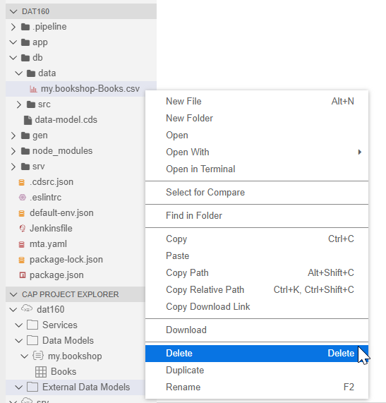
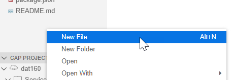
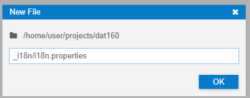
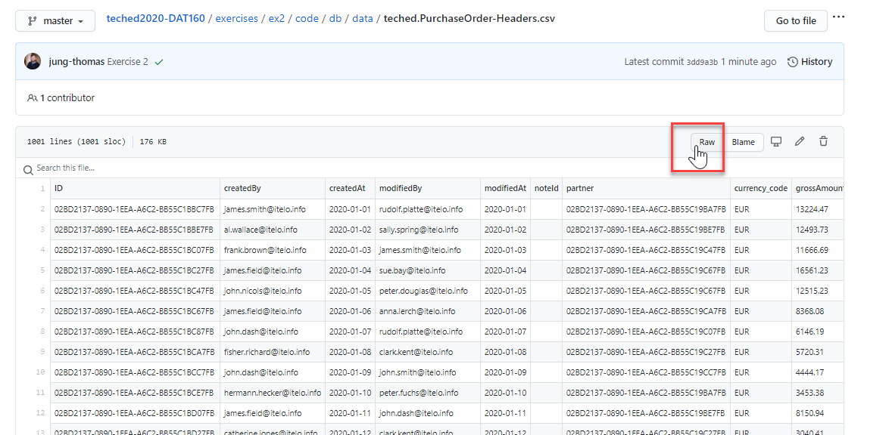
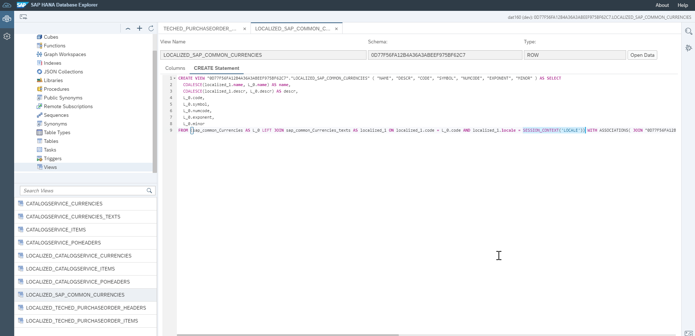

# Exercise 2 - Building the Data Model

[](./code/)

In this exercise, we will create a Purchase Order header and item table using Core Data Services (CDS). You will also create CSV files which will load data into your tables during the deploy process.

## Exercise 2.1 Cleanup and Preparations for New Data Model

After completing these steps you will have removed the sample data model and prepared your project with translatable texts.

1. Navigate to the **cat-service.cds** in the **/srv** folder and open it for editing. Comment out the using line and the entity. This removes references to the sample content and allows us to begin developing our own data model and build without receiving errors at the service definition layer.</br>

2. Also delete the sample csv from the **/db/data** folder. It's not going to be needed any longer.</br>

3. We want to avoid hard coding text strings in our data definition or service layers.  CAP allows us to use translatable text strings by externalizing them in a [i18n file](https://en.wikipedia.org/wiki/Internationalization_and_localization). Add **_i18n/i18n.properties** file into your project as shown. </br></br></br></br>Notice how we are able to create both folders and files from the single **New File** dialog.

4. Add the following text strings to the **i18n.properties** file. We will use these all throughout the remainder of the exercises.

```properties
po_id=Purchase Order ID
po_items=Purchase Order Items
poService=Purchase Order
poServices==Purchase Orders
buyerService=Buyer Details
userService=User Details
currencyService=Currency Code
CreateBy=Created By
CreateAt=Created Date
ChangedBy=Last Updated By
ChangedAt=Last Update Date
currency=Currency
partner_id=Partner ID
quantity=Quantity
quantityUnit=Quantity Unit
product=Product
products=Products
notes=Notes
grossAmount=Gross Amount
netAmount=Net Amount
taxAmount=Tax Amount
lifecycle=Lifecycle Status
approval=Approval Status
confirmation=Confirmation Status
ordering=Ordering Status
invoicing=Invoicing Status
note=Note
deliveryDate=Delivery Date
partnerId=Partner ID
partnerRole=Partner Role - Customer or Supplier
email=Email Address
phone=Phone Number
fax=Fax Number
web=Web Site Address
address=Address Association
company=Company Name
legal=Legal Form
building=Building Number
city=City
country=Country
region=Region Otherwise Known as State in some countries
addressType=Address Type
postalCode=Postal Code
street=Street
fname=Given Name
lname=Family Name
mname=Middel Name
userId=User Id
currCode=Currency Code
currDesc=Currency Description
internal_id=Internal ID
details=Details
code1=Country Code
alpha3=Three Character Country Code
iso=ISO 3166-2 Code
region=Region
sub_region=Sub Region
region_code=Region Code
sub_region_code=Sub Region Code
country=Country
sub_code=Subdivision Code
name=Subdivision Name
type=Subdivision Type
poServices=Purchase Order Services
gender=Gender
latitude=Geo Latitude
longitude=Geo Longitude
validFrom=Valid From
validTo=Valid To
addressId=Address Internal ID
employeeId=Employee Internal ID
initials=Initials
sex=Gender
language=Primary Spoken Language
phoneNumber=Primary Phone Number
email=Email Address
loginName=Login Username
accountNumber=Bank Account Number
salaryAmount=Salary Amount
bankId=Bank ID
bankName=Bank Name
employeePicUrl=Employee Picture URL
businessParnters=Business Partners
typeCode=Type Code
category=Product Category
name=Product Name
desc=Product Description
supplier=Supplier
weightMeasure=Weight Measure
weightUnit=Weight Unit
price=Price
picUrl=Product Picture URL
width=Width
depth=Depth
height=Height
dimensionUnit=Dimension Unit
addrService=Address
addrServices=Addresses
userService=User
userServices=Users
user_id=User ID
productImage=Product Image
productImageType=Product Image Typ
```

5. Navigate to the **data-model.cds** in the **/db** folder and open it for editing. Clear all of the sample content from this file</br>

## Exercise 2.2 Create Data Model

After completing these steps you will have created a Purchase Order header and item table using Core Data Services (CDS)

1. Return to the **/db/data-model.cds** file. This is where we will build our complete application data model

2. We start with a **using** block. This is how we import existing types and other reusable parts from other **cds** files, including from SAP standard delivered ones. Here were using the @sap/cds/common which contains valuable enterprise reuse concepts like currency conversion, generated GUID keys, etc.  This module is stored in the public npm repository as part of the @sap/cds module and needs no special configuration to load or reuse it.

```cds
using {
    Currency,
    managed,
    sap,
    cuid
} from '@sap/cds/common';
```

3. Using CAP we can also extend and enhance SAP delivered models as well. In the previous step we imported the **Currency** entity.  But now we can extend the definition of that entity and add three of our own columns to it.

```cds
extend sap.common.Currencies with {
    numcode  : Integer;
    exponent : Integer; //> e.g. 2 --> 1 Dollar = 10^2 Cent
    minor    : String; //> e.g. 'Cent'
}
```

4. Next we want to begin defining our own data model  We will wrap all of our own content in a context. To prefix the names of all subsequent definitions, place a namespace directive at the top of a model. This is comparable to other languages, like Java.  However here we will use a context which is essentially a namespace that can be nested within another section.

```cds
context teched.common {

}
```

5. The rest of the reusable content we will create will all be within this context section.  We will begin by creating some simple, reusable types. You can declare custom types to reuse later on, for example, for elements in entity definitions. Custom-defined types can be simple, that is derived from one of the predefined types, structure types or Associations. 

```cds
    type BusinessKey : String(10);
    type SDate : DateTime;
```

6. You can specify enumeration values for a type as a semicolon-delimited list of symbols. String and integer enums are supported. Here we will create an Enumeration for possible Purchase Order statuses. Also notice the annotation ```@assert.range```. This will trigger CAP to also validate any input data for field using this type and check that all values must be defined in the enumeration.

```cds
    @assert.range : true
    type StatusT : String(1) enum {
        New        = 'N';
        Incomplete = 'I';
        Approved   = 'A';
        Rejected   = 'R';
        Confirmed  = 'C';
        Saved      = 'S';
        Delivered  = 'D';
        Cancelled  = 'X';
    }
```

7. We can also declare custom structure types, combining multiple fields together into one reusable unit which gets expanded into the entity in which they are used.</br>When mapped to relational databases, such entity definitions are translated to tables. You can prefix an entity definition with the keyword abstract to not create a table (or view) when mapped to a database

```cds
    type AmountT : Decimal(15, 2)@(
        Semantics.amount.currencyCode : 'CURRENCY_code',
        sap.unit                      : 'CURRENCY_code'
    );

    abstract entity Amount {
        currency    : Currency;
        grossAmount : AmountT;
        netAmount   : AmountT;
        taxAmount   : AmountT;
    }

    annotate Amount with {
        grossAmount @(title : '{i18n>grossAmount}');
        netAmount   @(title : '{i18n>netAmount}');
        taxAmount   @(title : '{i18n>taxAmount}');
    }
```

8. Similar to our Amount abstract entity, let's also add a another one for Quantity and Quantity Unit.

```cds
    type QuantityT : Decimal(13, 3)@(title : '{i18n>quantity}');
    type UnitT : String(3)@title : '{i18n>quantityUnit}';

    abstract entity Quantity {
        quantity     : QuantityT;
        quantityUnit : UnitT;
    }
```

9. Entities are structured types with named and typed elements, representing sets of (persisted) data that can be read and manipulated using usual CRUD operations. They usually contain one or more designated primary key elements. Here we have the entity for our Purchase Order Headers table.  We also switch to a new context to separate the transactional table from our earlier reusable types and abstract entities. </br>This example also uses Compositions to the Item entity we will create momentarily. Compositions constitute document structures through ‘contained-in’ relationships. They frequently show up in to-many header-child scenarios. Essentially Compositions are the same as associations, just with the additional information that this association represents a contained-in relationship so the same syntax and rules apply in their base form.

```cds
context teched.PurchaseOrder {
    entity Headers : managed, cuid, teched.common.Amount {
        @cascade : {all}
        item            : Composition of many Items
                              on item.poHeader = $self;
        noteId          : teched.common.BusinessKey null;
        partner         : UUID;
        lifecycleStatus : teched.common.StatusT default 'N';
        approvalStatus  : teched.common.StatusT;
        confirmStatus   : teched.common.StatusT;
        orderingStatus  : teched.common.StatusT;
        invoicingStatus : teched.common.StatusT;
    }
}
```

10. Now for the Purchase Order Items entity.  Here we use an Association back to the Header entity. This is a managed association. For to-one associations, CDS can automatically resolve and add requisite foreign key elements from the target’s primary keys and implicitly add respective join conditions.

```cds
    entity Items : cuid, teched.common.Amount, teched.common.Quantity {
        poHeader     : Association to Headers;
        product      : teched.common.BusinessKey;
        noteId       : teched.common.BusinessKey null;
        deliveryDate : teched.common.SDate;
    }
```

11. We've described several different parts of the data model we want to create and there are some sections nested using different contexts.  The complete file should look like the following.  Be sure to match up to this example.

```cds
using {
    Currency,
    managed,
    sap,
    cuid
} from '@sap/cds/common';

extend sap.common.Currencies with {
    numcode  : Integer;
    exponent : Integer; //> e.g. 2 --> 1 Dollar = 10^2 Cent
    minor    : String; //> e.g. 'Cent'
}

context teched.common {
    type BusinessKey : String(10);
    type SDate : DateTime;

    @assert.range : true
    type StatusT : String(1) enum {
        New        = 'N';
        Incomplete = 'I';
        Approved   = 'A';
        Rejected   = 'R';
        Confirmed  = 'C';
        Saved      = 'S';
        Delivered  = 'D';
        Cancelled  = 'X';
    }

    type AmountT : Decimal(15, 2)@(
        Semantics.amount.currencyCode : 'CURRENCY_code',
        sap.unit                      : 'CURRENCY_code'
    );

    abstract entity Amount {
        currency    : Currency;
        grossAmount : AmountT;
        netAmount   : AmountT;
        taxAmount   : AmountT;
    }

    annotate Amount with {
        grossAmount @(title : '{i18n>grossAmount}');
        netAmount   @(title : '{i18n>netAmount}');
        taxAmount   @(title : '{i18n>taxAmount}');
    }

    type QuantityT : Decimal(13, 3)@(title : '{i18n>quantity}');
    type UnitT : String(3)@title : '{i18n>quantityUnit}';

    abstract entity Quantity {
        quantity     : QuantityT;
        quantityUnit : UnitT;
    }
}

context teched.PurchaseOrder {
    entity Headers : managed, cuid, teched.common.Amount {
        @cascade : {all}
        item            : Composition of many Items
                              on item.poHeader = $self;
        noteId          : teched.common.BusinessKey null;
        partner         : UUID;
        lifecycleStatus : teched.common.StatusT default 'N';
        approvalStatus  : teched.common.StatusT;
        confirmStatus   : teched.common.StatusT;
        orderingStatus  : teched.common.StatusT;
        invoicingStatus : teched.common.StatusT;
    }

    entity Items : cuid, teched.common.Amount, teched.common.Quantity {
        poHeader     : Association to Headers;
        product      : teched.common.BusinessKey;
        noteId       : teched.common.BusinessKey null;
        deliveryDate : teched.common.SDate;
    }
}
```

12. Annotations allow us to add metadata and other features not directly defined in the main CDS syntax to our data model. For example Annotations might be used to add text descriptions to a data model.  They are also heavily used in describing the user interface without getting into UI technology specifics.</br>Annotations are inherited from types and base types to derived types, entities, and elements as well as from elements of underlying entities in case of views. Although we could have defined the annotations directly in the entity definitions, a common best practice is separate the annotations from the entity definition for better maintenance. In fact we will create a separate file in our project for our annotations.</br> Create a new file in the **/db** folder named **po-annotations.cds**. Use the following coding for this file.

```cds
using teched.PurchaseOrder as PO from './data-model';

annotate PO.Headers with @(
    title       : '{i18n>poService}',
    description : '{i18n>poService}'
) {
    ID              @(
        title       : '{i18n>po_id}',
        description : '{i18n>po_id}',
    );

    items           @(
        title       : '{i18n>po_items}',
        description : '{i18n>po_items}'
    );

    partner         @(
        title            : '{i18n>partner_id}',
        description      : '{i18n>partner_id}'
    );

    lifecycleStatus @(
        title               : '{i18n>lifecycle}',
        description         : '{i18n>lifecycle}',
        Common.FieldControl : #ReadOnly
    );

    approvalStatus  @(
        title               : '{i18n>approval}',
        description         : '{i18n>approval}',
        Common.FieldControl : #ReadOnly
    );

    confirmStatus   @(
        title               : '{i18n>confirmation}',
        description         : '{i18n>confirmation}',
        Common.FieldControl : #ReadOnly
    );

    orderingStatus  @(
        title               : '{i18n>ordering}',
        description         : '{i18n>ordering}',
        Common.FieldControl : #ReadOnly
    );

    invoicingStatus @(
        title               : '{i18n>invoicing}',
        description         : '{i18n>invoicing}',
        Common.FieldControl : #ReadOnly
    );
};

annotate Items with {
    ID           @(
        title       : '{i18n>internal_id}',
        description : '{i18n>internal_id}',
    );

    product      @(
        title               : '{i18n>product}',
        description         : '{i18n>product}',
        Common.FieldControl : #Mandatory,
        Search.defaultSearchElement
    );

    deliveryDate @(
        title       : '{i18n>deliveryDate}',
        description : '{i18n>deliveryDate}'
    )
}
```

13. Build the new data model using the ```npm run build``` command from the Terminal. This will compile these CDS definitions into HANA specific development artifacts.  Now deploy these new definitions into the SAP HANA Cloud database using the command ```npm run hana``` from the terminal. Your output should look like the following:</br>

14. You can return to the Database Explorer and check your results.  You should now have a Purchase Order Header and Item tables, although they do not yet contain any data.</br>

## Exercise 2.3 Load Initial Data From CSV

After completing these steps you will have CSV files which will load initial, test data into your new tables.

1. In the **/db/data** folder we will now create CSV files to load initial data. </br>

2. Add a csv for Currencies via a file named **/db/data/sap.common-Currencies.csv** with the following content:

```csv
code;symbol;name;descr;numcode;minor;exponent
EUR;€;Euro;European Euro;978;Cent;2
USD;$;US Dollar;United States Dollar;840;Cent;2
CAD;$;Canadian Dollar;Canadian Dollar;124;Cent;2
AUD;$;Australian Dollar;Canadian Dollar;036;Cent;2
GBP;£;British Pound;Great Britain Pound;826;Penny;2
ILS;₪;Shekel;Israeli New Shekel;376;Agorat;2
INR;₹;Rupee;Indian Rupee;356;Paise;2
QAR;﷼;Riyal;Katar Riyal;356;Dirham;2
SAR;﷼;Riyal;Saudi Riyal;682;Halala;2
JPY;¥;Yen;Japanese Yen;392;Sen;2
CNY;¥;Yuan;Chinese Yuan Renminbi;156;Jiao;1
```

3. We defined our currency descriptions as localized. This means we can also load language specific values for this column via a separate CSV file. Add currencies texts via the file **/db/data/sap.common-Currencies_texts.csv** and the following values for German and French.

```csv
code;locale;name;descr
EUR;de;Euro;European Euro
USD;de;US-Dollar;United States Dollar
CAD;de;Kanadischer Dollar;Kanadischer Dollar
AUD;de;Australischer Dollar;Australischer Dollar
GBP;de;Pfund;Britische Pfund
ILS;de;Schekel;Israelische Schekel
EUR;fr;euro;de la Zone euro
USD;fr;dollar;dollar des États-Unis
CAD;fr;dollar canadien;dollar canadien
AUD;fr;dollar australien;dollar australien
GBP;fr;livre sterling;pound sterling
ILS;fr;Shekel;shekel israelien
```

4. Next we want to add CSV files for the main transactional tables.  There are many more records in these files, so please cut and paste them directly from these links.  Start by creating the file **/db/data/teched.PurchaseOrder-Headers.csv**. You can copy the data from [teched.PurchaseOrder-Headers.csv](code/db/data/teched.PurchaseOrder-Headers.csv) but please switch to Raw in Github to get a clear Copy and Paste. 

5. Repeat this process for Purchase Order Items in file **/db/data/teched.PurchaseOrder-Items.csv**, copy from [teched.PurchaseOrder-Items.csv](code/db/data/teched.PurchaseOrder-Items.csv)

6. Repeat the process from earlier to deploy the content into the database.  From the terminal first build using ```npm run build```.  Then deploy to HANA using ```npm run hana```.

7. Check results in the Database Explorer. You should now have data in your PO header and item tables </br>

8. Notice that for the Currencies we also have a view defined. This is because of the localized column. The localized feature created a view with **SESSION_CONTEXT('LOCALE')**. This will be used by CAP to automatically load the description for the current logon language. We will see this feature in action later once we have the service interface for our project.</br> 

## Summary

You've now completed the data model for our project and loaded it with initial data. Next we will begin creating the service layer for our application so we can expose OData V2 and V4 service endpoints.

Continue to - [Exercise 3 - Service Layer](../ex3/README.md)
