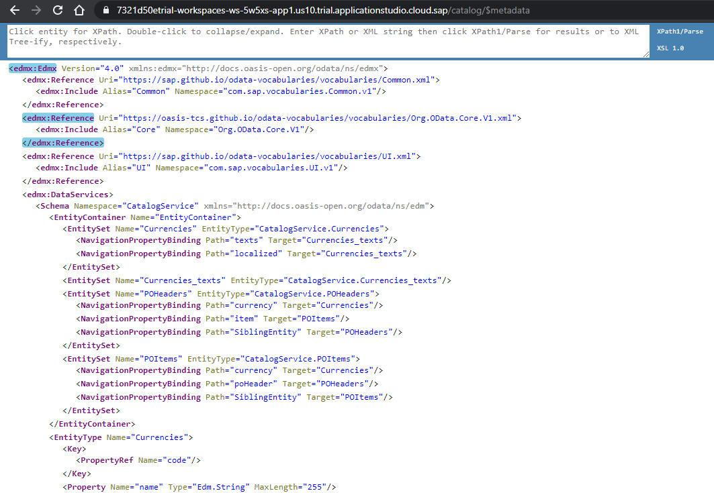
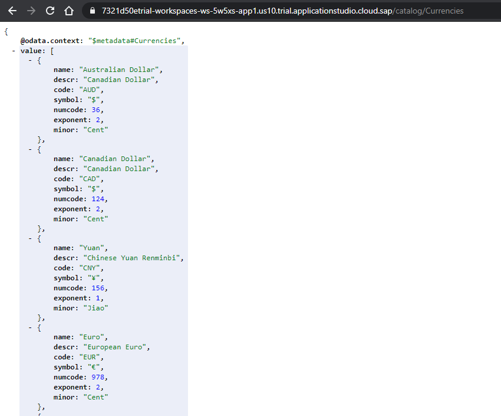
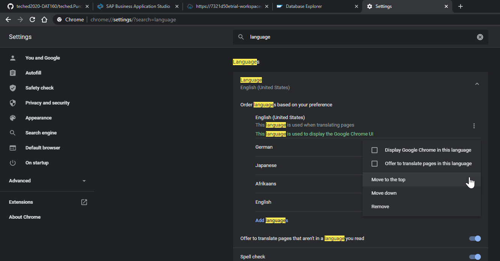
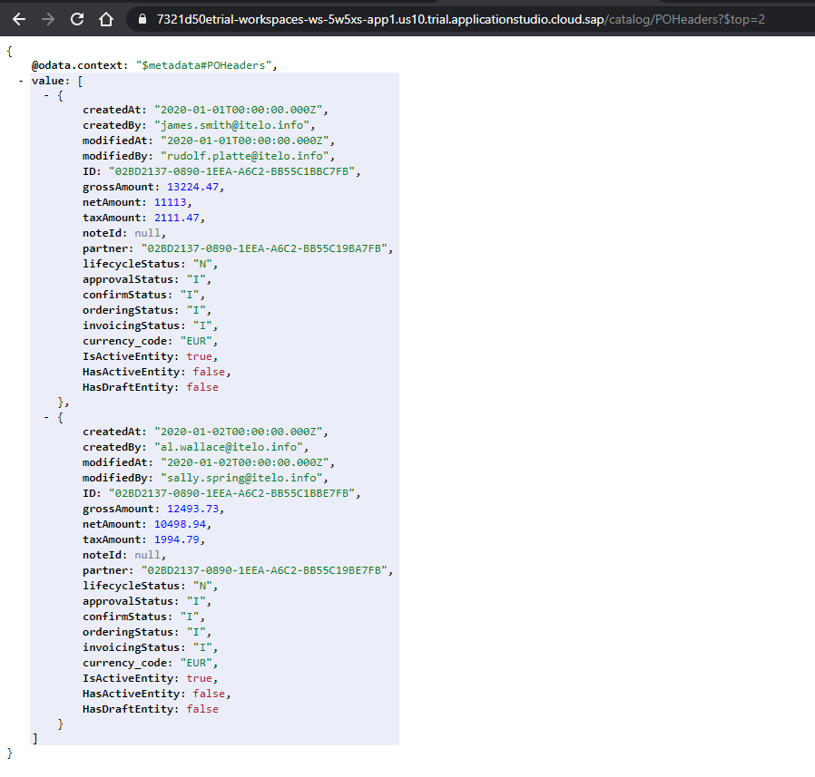
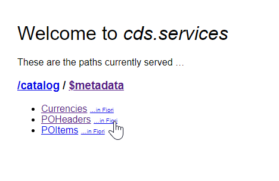
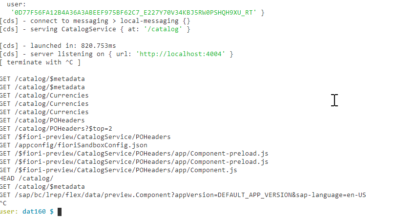
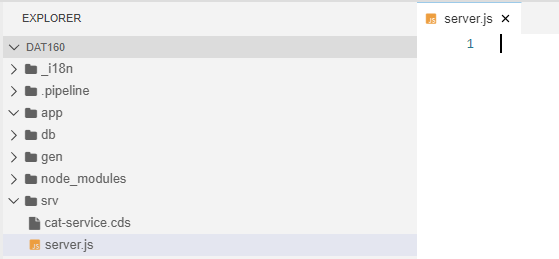
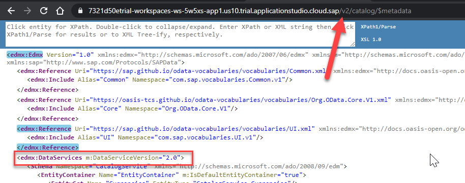
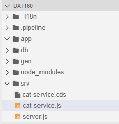

# Exercise 3 - Service Layer

[](./code/)

In this exercise, we will create and test the service layer of our application. We will also see how to add OData V2 support in addition to the default service layer technology of OData V4. Finally we will see how to implement service handlers to either enhance or override the standard processing in the service layer.

## Exercise 3.1 Create Service

After completing these steps you will have created an OData V4 service from our CAP data model.

1. Edit **/srv/cat-service.cds**. Add the following syntax to the file to expose the Purchase Order Headers and Items entity as part of our service definition.  Notice that we also use the annotation **odata.draft.enabled** on the Purchase Order Header. This is all that is need to activate [Draft-Based Editing](https://experience.sap.com/fiori-design-web/draft-handling/) support. 

```cds
using teched.PurchaseOrder as PO from '../db/data-model';

service CatalogService {
    entity POHeaders @(
        title               : '{i18n>poService}',
        odata.draft.enabled : true
    ) as projection on PO.Headers;

    entity POItems @(
        title               : '{i18n>poService}',
    ) as projection on PO.Items;
}
```

2. Save the file. Build the project using the command ```npm run build``` from the Terminal. Deploy to HANA database again because service definitions also create HANA views that need to exist within the database. Use the command ```npm run hana``` to deploy to HANA.  

3. Once the deployment to the database is complete, run ```npm start``` from the Terminal. This uses the start script from the package.json which is ```cds run```. This will run the service layer of our CAP application temporarily, directly from the Business Application Studio. This allows us to test and debug without ever having to deploy the application to Cloud Foundry or Kubernetes and saves considerable time. </br>

4. Once running you will have a small dialog in the bottom right corner of the Business Application Studio. Click the ***Expose and Open*** button to open the running applications URL in a new browser tab.

5. Upon first run you will be asked if you want to add a description to the running port. This helps if you are running multiple applications from the Business Application Studio and want to administer them later. </br>

6. You will receive a message that the port 4004 which your CAP application runs on has been exposed and a new browser tab should open with the CAP explorer page.</br>

7. If you accidentally close the other tab or just want an overview of all running and exposed ports you can use the **Ports:Preview** from the command pallet and relaunch from the results</br>

8. This is the Cloud Application Programming Model preview tool. It allows you to quickly view and test your service endpoints. It even has a Fiori UI preview built in. Notice that it also lists Currencies although we didn't expose it in the service layer. CAP is smart enough to know that this entity is a dependency based upon the relationships defined in the data model and automatically add this entity to the service layer as well.</br>

9. Click on the **$metadata** link for the service. This is the OData V4 metadata document for our service layer.</br> 

10. If you scroll down in the metadata document you will see the annotations we defined are embedded in the document. This means that for Fiori or UI5 development we don't need to maintain separate annotation definition files. Any annotations we define in our model are automatically exposed via the service interface metadata.</br> 

11. Navigate back to the entry test page.  Click on the Currencies entity link. You should see the data displayed in OData V4 JSON format in the browser.</br> 

12. But remember that the Currencies **descr** column is localized and we loaded values for this column in German and French. Change your browser language to German (the screenshot shows the settings for doing this in Chrome.). Move the German language to the top of the language list.</br> 

13. Return to the tab displaying the Currencies data. Refresh the display and you will see that the  descriptions have changed to their translated values. This is part of the value of Cloud Application Programming Model.  Enterprise features like translatable texts are handled automatically for you without any additional logic.</br> 

14. Feel free to test Purchase Order Header and Items display as well. Just note they container larger number of records.  Perhaps try adding some of the standard OData URL parameters like **$top=2** to limit the returned data </br> 

15. Return to the test tool entry page. Click on the **Fiori Preview** link for POHeaders.</br>  

16. The fiori preview will load but no columns or filters will be available. We've not specified enough UI annotations in our model yet. We will add those in Exercise 4 and return to the Fiori Preview at that point</br> 

17. Return to Editor in the Business Application Studio. You can use **CTRL+C** to stop the running service.</br>

## Exercise 3.2 Add OData V2 Support

After completing these steps you will have enhanced your existing service layer with an OData V2 endpoint.

1. The Cloud Application Programming model comes with optional support for OData V2. This is useful for backwards compatibility especially if you need to use the full range of Fiori Elements templates; not all of which have been updated to OData V4 yet. This functionality is proved via additional Node.js module. Return to the root folder **package.json** file and add the dependency to "@sap/cds-odata-v2-adapter-proxy".</br>

2. Save and Run ```npm install```.

3. Create a new file in **/srv** named **server.js**. **server.js** is a special named file which CAP will use automatically as a custom bootstrap to the startup of the entire service framework. This will allow us to inject this optional module into our CAP service.</br>

4. Here is the minimal coding needed for server.js It tells CAP to run the Odata V2 project module upon startup.  This will then provide two service endpoints - one for OData V4 and one for OData V2. 

```javascript
const cds = require('@sap/cds')
const proxy = require('@sap/cds-odata-v2-adapter-proxy')

cds.on('bootstrap', app => app.use(proxy()))
module.exports = cds.server
```

5. Save your server.js file. From the terminal run ```npm start```.  Notice in the startup log there is a new section that talks about proxy and rewrite rules.</br>

6. Open CAP preview page again. No entries will be shown for the V2 version of the service in the preview tool. </br> 

7. But if you open the V4 entity in the preview and manually add **/v2/** into the URL you will see the results change</br>

8. The same can be done for the **metadata** call</br>

## Exercise 3.3 Custom Handlers

After completing these steps you will have added custom logic to the CAP generic service handlers.

1. Create a file named **cat-service.js** in the **/srv** folder. The name must match **cat-service.cds** just with the different file extension for JavaScript. The matching naming tells CAP that you want to use this file to write custom exit handlers for the services defined in **cat-service.cds**. </br>

2. Add the following coding to this file. It defines a customer event handler that will be processed after the standard process for each record read in the Purchase Order Headers entity. For now we won't add any special logic of our own.  We will just record the record processed into the log so that we can test that our service exit handler is being triggered.

```JavaScript
const cds = require('@sap/cds')
module.exports = cds.service.impl(function () {
    const { POHeaders } = this.entities()

    this.after('each', POHeaders, row =>{
        console.log(`Read PO: ${row.ID}`)
    })
})
```

3. Save. Run ```npm run build``` and then ```npm start```.  The log shows the new service implementation file </br>

4. In the test tool, query the PO Header request with the top=2 parameter to only read two records. </br>

5. When you return to the Terminal console output in the Business Application Studio, you should see those two reads each logged. <br>

6. Return to **cat-service.js** in the editor. Now let's make it more interesting.  Add logic to raise a message on the message bus every time a PO Header is Created, Updated, or Deleted:

```JavaScript
const cds = require('@sap/cds')
module.exports = cds.service.impl(function () {

    const { POHeaders } = this.entities()

    this.after('each', POHeaders, row =>{
        console.log(`Read PO: ${row.ID}`)
    })

    this.after(['CREATE', 'UPDATE', 'DELETE'], [POHeaders], async (po, req) => {
        const header = req.data
        req.on('succeeded', () => {
            global.it || console.log(`< emitting: poChanged ${header.ID}`)
            this.emit('poChange', header)
        })
    })
})
```

1. We will be able to test that later once we have our full Fiori UI and can edit or create records from it.

## Summary

You've now fully implemented our service layer.  Next will add UI annotations and create our Fiori application.

Continue to - [Exercise 4 - User Interface](../ex4/README.md)