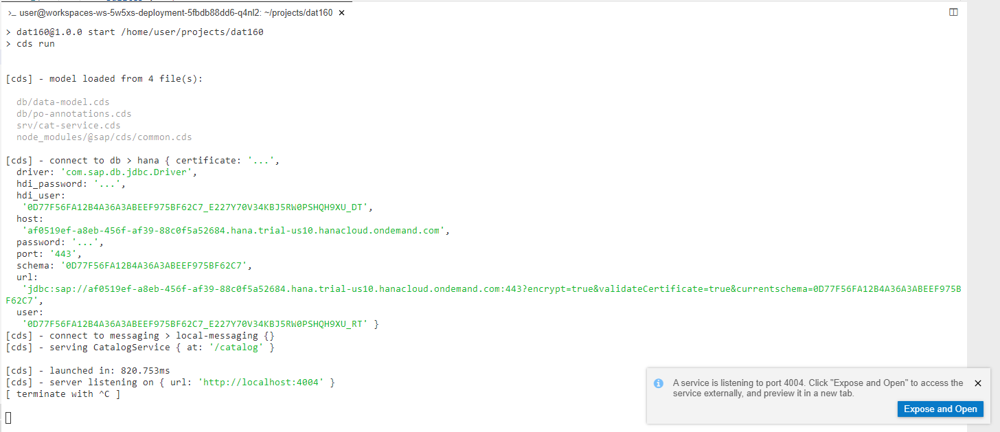
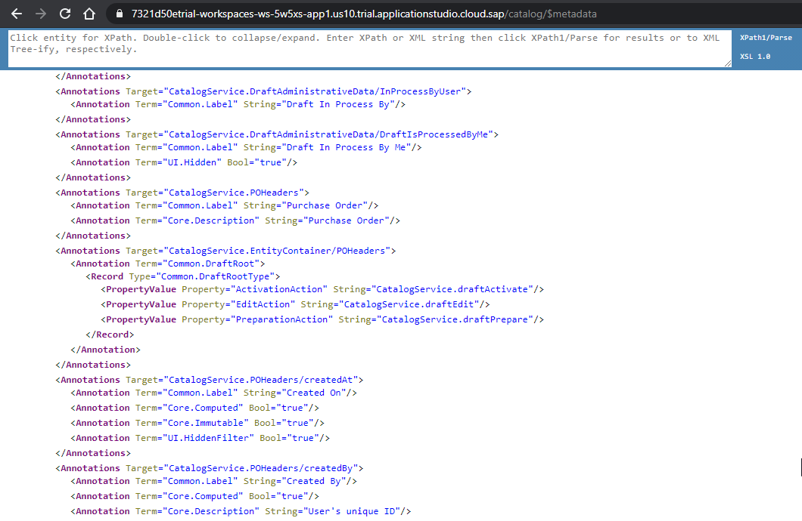
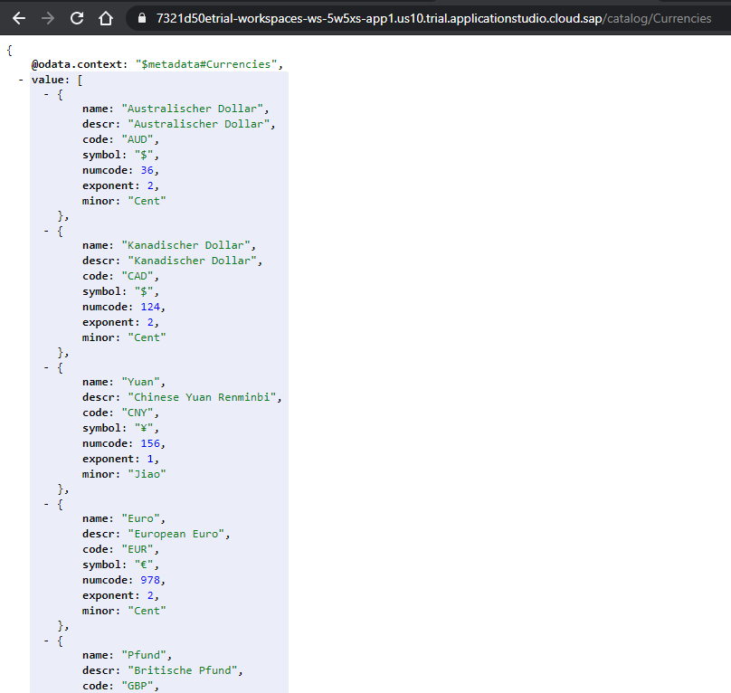
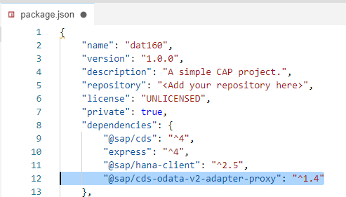
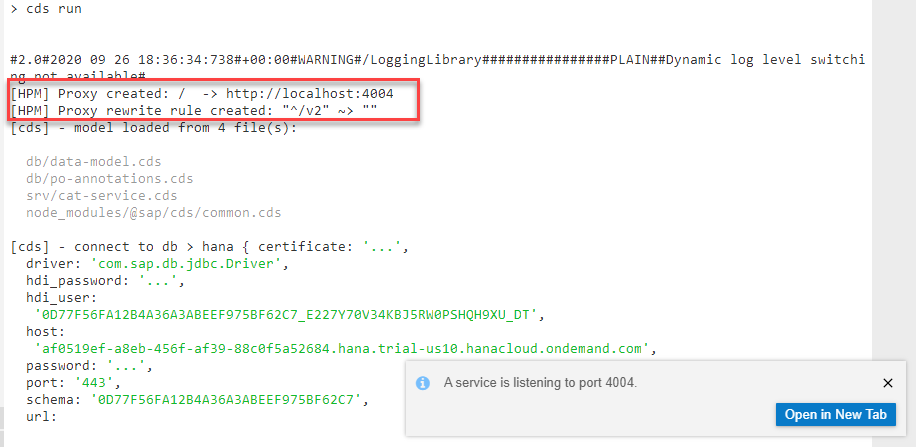
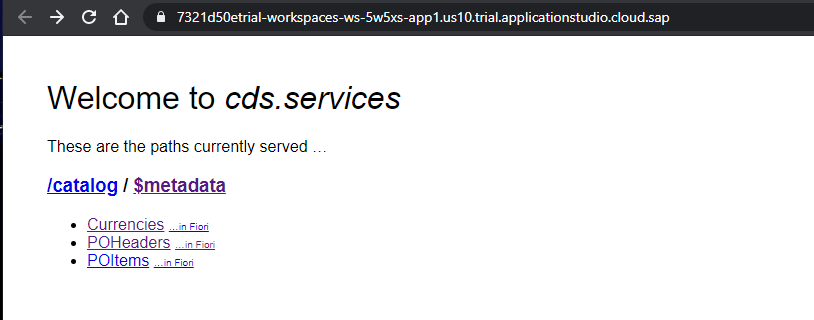
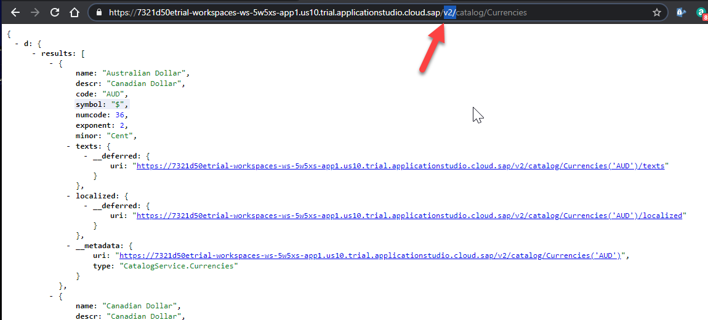
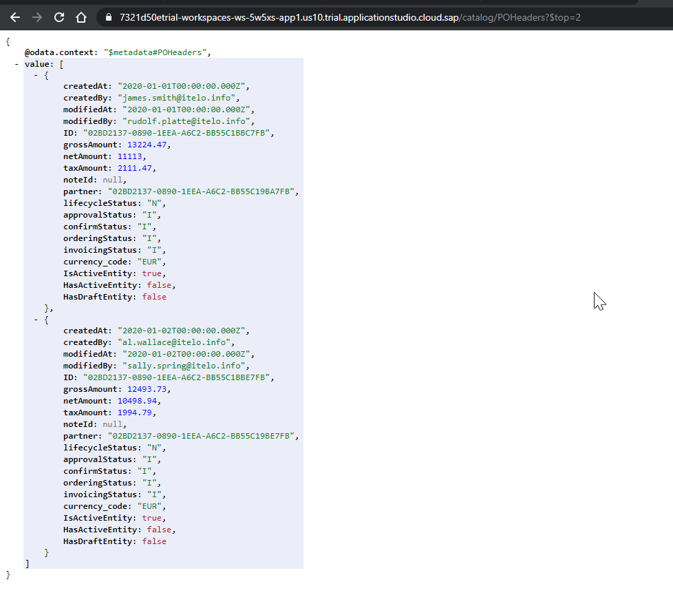

# Exercise 3 - Service Layer

[](./code/)

In this exercise, we will create...

## Exercise 3.1 Create Service

After completing these steps you will have created...

1. Edit /srv/cat-service.cds. Expose Purchase Order Headers and Items

```cds
using teched.PurchaseOrder as PO from '../db/data-model';

service CatalogService {
    entity POHeaders @(
        title               : '{i18n>poService}',
        odata.draft.enabled : true
    ) as projection on PO.Headers;

    entity POItems @(
        title               : '{i18n>poService}',
    ) as projection on PO.Items;
}
```

2. Save, build ```npm run build``` and deploy to HANA ```npm run hana```.  We have to deploy to HANA even though we didn't change the data model becuase service entities generate views

3. Run ```npm start``` uses the start srcipt which is ```cds run``` </br>

4. Click the ***Expose and Open***

5. Asked if you want to added a descirption </br>

6. You will recieve a message that the port 4004 which CDS runs on has been exposed and a new browser tab should open with the CDS explorer page.</br>

7. If you accidentally close the other tab or just want an overview of all running and exposed ports you can use the Ports:Preview and relaunch from the results</br>

8. Initial preview - notice Currencies although we didn't expose it in the service layer </br>

9. metadata 

10. metadata annotations 

11. Currencies 

12. Change Browser language 

13. Currencies description changed 

14. Feel free to test PO and Items.  Try some of the OData url parameters like **$top=2** 

15. Fiori Preview 

16. Not enough annotations yet. We will add those in Exercise 4 

17. Return to Editor. Can use **CTRL+C** to stop run. Also can use ```cds watch``` 

## Exercise 3.2 Add OData V2 Support

After completing these steps you will have...

1. package.json dependency to "@sap/cds-odata-v2-adapter-proxy" </br>

2. Save and Run ```npm install```

3. Create new file in /srv named server.js - this is a special named file which CAP will use automatically as a custom boostrap </br>

4. Coding for server.js - explain

```javascript
const cds = require('@sap/cds')
const proxy = require('@sap/cds-odata-v2-adapter-proxy')

cds.on('bootstrap', app => app.use(proxy()))
module.exports = cds.server
```

5. Save - ```npm start```  Notice Log </br>

6. Open Preview - no entries shown for the V2 version. </br> 

7. But if you open the entity in the preview and manually add /v2/ into the URL you will see the resutls change</br>

8. The same can be done for the **metadata** call</br>

## Exercise 3.3 Custom Handlers

After completing these steps you will have...

1. Create file named cat-service.js - name must match cat-service.cds. </br>

2. Add coding for after read to log each reach -- special processing for the each action

```JavaScript
const cds = require('@sap/cds')
module.exports = cds.service.impl(function () {
    const { POHeaders } = this.entities()

    this.after('each', POHeaders, row =>{
        console.log(`Read PO: ${row.ID}`)
    })
})
```

3. Save. ```npm run build```, ```npm start```.  Log shows the new service implementation file </br>

4. Run the PO Header request with the top=2 parameter to only read two records. </br>

5. See those two reads each logged. <br>

6. Return to cat-service.js. Make it more interesting.  Add logic to raise a message on the message bus every time a PO Header is Created, Updated, or Deleted

```JavaScript
const cds = require('@sap/cds')
module.exports = cds.service.impl(function () {

    const { POHeaders } = this.entities()

    this.after('each', POHeaders, row =>{
        console.log(`Read PO: ${row.ID}`)
    })

    this.after(['CREATE', 'UPDATE', 'DELETE'], [POHeaders], async (po, req) => {
        const header = req.data
        req.on('succeeded', () => {
            global.it || console.log(`< emitting: poChanged ${header.ID}`)
            this.emit('poChange', header)
        })
    })
})
```

7. Will be able to test that later once we have a better UI

## Summary

You've now ...

Continue to - [Exercise 4 - User Interface](../ex4/README.md)