# Exercise 4 - User Interface

In this exercise, we will create...

## Exercise 4.1 Add Fiori Annotations

After completing these steps you will have created...

1. Create file /srv/po-header-fiori.cds

```cds
using CatalogService as pos from './cat-service';


annotate pos.POHeaders with @( // header-level annotations
    // ---------------------------------------------------------------------------
    // List Report
    // ---------------------------------------------------------------------------
    // POs List
    UI        : {
        LineItem            : [
        {
            $Type             : 'UI.DataField',
            Value             : ID,
            ![@UI.Importance] : #High
        },
        {
            $Type             : 'UI.DataField',
            Value             : grossAmount,
            ![@UI.Importance] : #High
        },
        {
            $Type             : 'UI.DataField',
            Value             : currency_code,
            ![@UI.Importance] : #Medium
        },
        {
            $Type : 'UI.DataField',
            Value : currency.symbol
        },
        ],
        PresentationVariant : {SortOrder : [
        {
            $Type      : 'Common.SortOrderType',
            Property   : ID,
            Descending : false
        },
        {
            $Type      : 'Common.SortOrderType',
            Property   : partner,
            Descending : false
        }
        ]}
    },

    // ---------------------------------------------------------------------------
    // Object Page
    // ---------------------------------------------------------------------------
    // Page Header
    UI        : {
        HeaderInfo                     : {
            TypeName       : '{i18n>poService}',
            TypeNamePlural : '{i18n>poServices}',
            Title          : {Value : ID},
        },
        HeaderFacets                   : [
        {
            $Type             : 'UI.ReferenceFacet',
            Target            : '@UI.FieldGroup#Description',
            ![@UI.Importance] : #Medium
        },
        {
            $Type             : 'UI.ReferenceFacet',
            Target            : '@UI.FieldGroup#AdministrativeData',
            ![@UI.Importance] : #Medium
        }
        ],
        FieldGroup #Description        : {Data : [
        {
            $Type : 'UI.DataField',
            Value : ID
        }
        ]},
        FieldGroup #Details            : {Data : [
        {
            $Type : 'UI.DataField',
            Value : partner
        },
        {
            $Type             : 'UI.DataField',
            Value             : noteId,
            ![@UI.Importance] : #Medium
        },
        {
            $Type : 'UI.DataField',
            Value : grossAmount
        },
        {
            $Type : 'UI.DataField',
            Value : netAmount
        },
        {
            $Type : 'UI.DataField',
            Value : taxAmount
        },
        {
            $Type : 'UI.DataField',
            Value : currency_code
        },
        {
            $Type                   : 'UI.DataField',
            Value                   : currency.symbol,
            ![@Common.FieldControl] : #ReadOnly
        },
        {
            $Type                   : 'UI.DataField',
            Value                   : currency.name,
            ![@Common.FieldControl] : #ReadOnly
        },
        ]},
        FieldGroup #AdministrativeData : {Data : [
        {
            $Type : 'UI.DataField',
            Value : createdBy
        },
        {
            $Type : 'UI.DataField',
            Value : createdAt
        },
        {
            $Type : 'UI.DataField',
            Value : modifiedBy
        },
        {
            $Type : 'UI.DataField',
            Value : modifiedAt
        }
        ]}
    },
    // Page Facets
    UI.Facets : [
    {
        $Type  : 'UI.CollectionFacet',
        ID     : 'PODetails',
        Label  : '{i18n>details}',
        Facets : [{
            $Type  : 'UI.ReferenceFacet',
            Label  : '{i18n>details}',
            Target : '@UI.FieldGroup#Details'
        }]
    },
    {
        $Type  : 'UI.ReferenceFacet',
        Label  : '{i18n>po_items}',
        Target : 'item/@UI.LineItem'
    }
    ]
);
```

2. Discuss key parts

3. Discuss key parts - part 2

4. Create file /srv/po-item-fiori.cds

```cds
using CatalogService as pos from './cat-service';


annotate pos.POItems with @( // header-level annotations
    // ---------------------------------------------------------------------------
    // List Report
    // ---------------------------------------------------------------------------
    // PO Items List
    UI        : {
        LineItem            : [
        {
            $Type             : 'UI.DataField',
            Value             : product,
            ![@UI.Importance] : #High
        },
        {
            $Type             : 'UI.DataField',
            Value             : deliveryDate,
            ![@UI.Importance] : #High
        },
        {
            $Type             : 'UI.DataField',
            Value             : quantity,
            ![@UI.Importance] : #High
        },
        {
            $Type             : 'UI.DataField',
            Value             : quantityUnit,
            ![@UI.Importance] : #High
        }
        ],
        PresentationVariant : {SortOrder : [{
            $Type      : 'Common.SortOrderType',
            Property   : product,
            Descending : false
        }]}
    },
    // ---------------------------------------------------------------------------
    // Object Page
    // ---------------------------------------------------------------------------
    // Page Header
    UI        : {
        HeaderInfo              : {
            TypeName       : '{i18n>poService}',
            TypeNamePlural : '{i18n>poServices}',
            Title          : {Value : ID},
        },
        HeaderFacets            : [{
            $Type             : 'UI.ReferenceFacet',
            Target            : '@UI.FieldGroup#Description',
            ![@UI.Importance] : #Medium
        }],
        FieldGroup #Description : {Data : [
        {
            $Type : 'UI.DataField',
            Value : ID
        },
        {
            $Type : 'UI.DataField',
            Value : product
        }
        ]},
        FieldGroup #Details     : {Data : [
        {
            $Type : 'UI.DataField',
            Value : product
        },
        {
            $Type             : 'UI.DataField',
            Value             : deliveryDate,
            ![@UI.Importance] : #High
        },
        {
            $Type             : 'UI.DataField',
            Value             : quantity,
            ![@UI.Importance] : #High
        },
        {
            $Type             : 'UI.DataField',
            Value             : quantityUnit,
            ![@UI.Importance] : #High
        }
        ]}
    },
    // Page Facets
    UI.Facets : [{
        $Type  : 'UI.CollectionFacet',
        ID     : 'POItemsDetails',
        Label  : '{i18n>details}',
        Facets : [{
            $Type  : 'UI.ReferenceFacet',
            Label  : '{i18n>details}',
            Target : '@UI.FieldGroup#Details'
        }]
    }]
);
```

5. Save, Build ```npm run build```, Run ```npm start```

6. Open Fiori Preview for Purchase Order Header</br>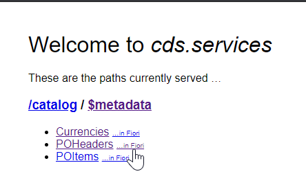

7. This time the UI will work because its being driven by the Annotations. </br>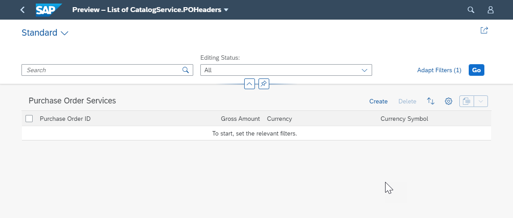

8. Draft support </br>

9. Press **Go** to run query </br>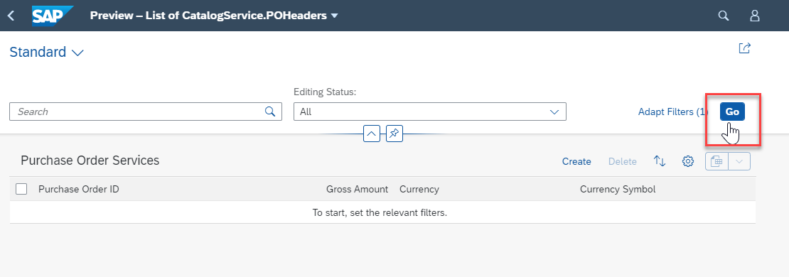 

10. Discuss features of the list view </br>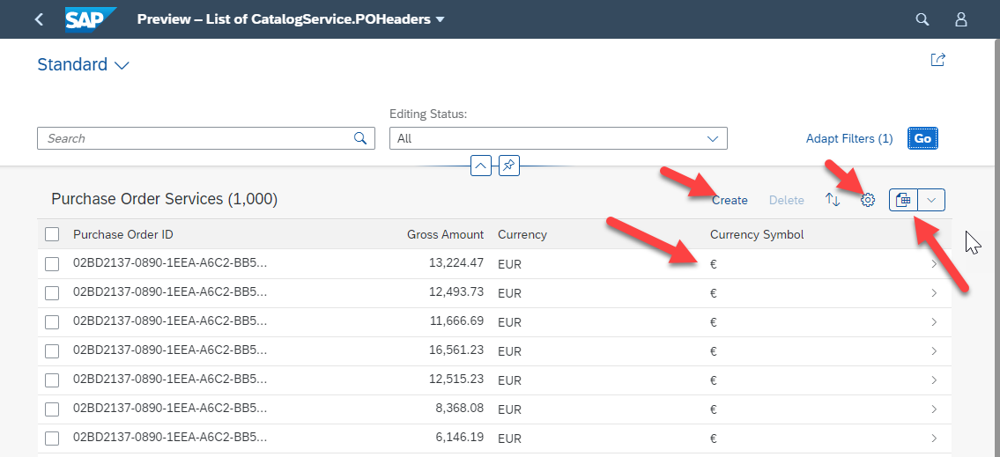 

11. Press the next arrow on a line and see the Detailed View, including Items </br>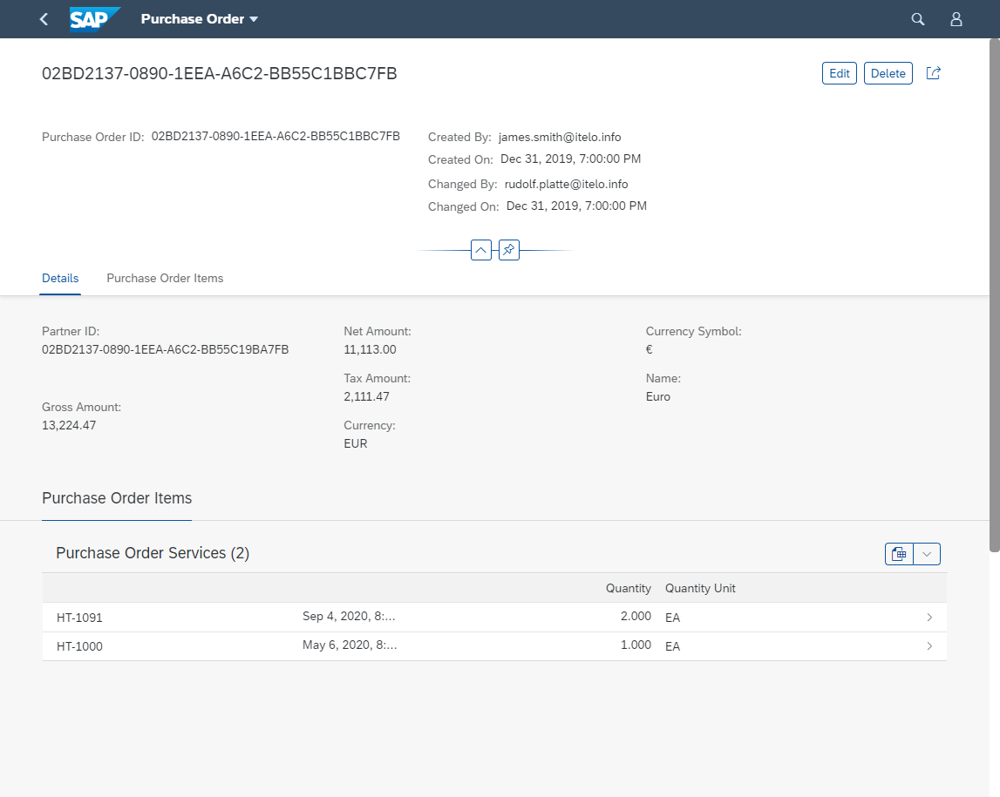

12. Press Edit.  Change Net Amount. Save. </br>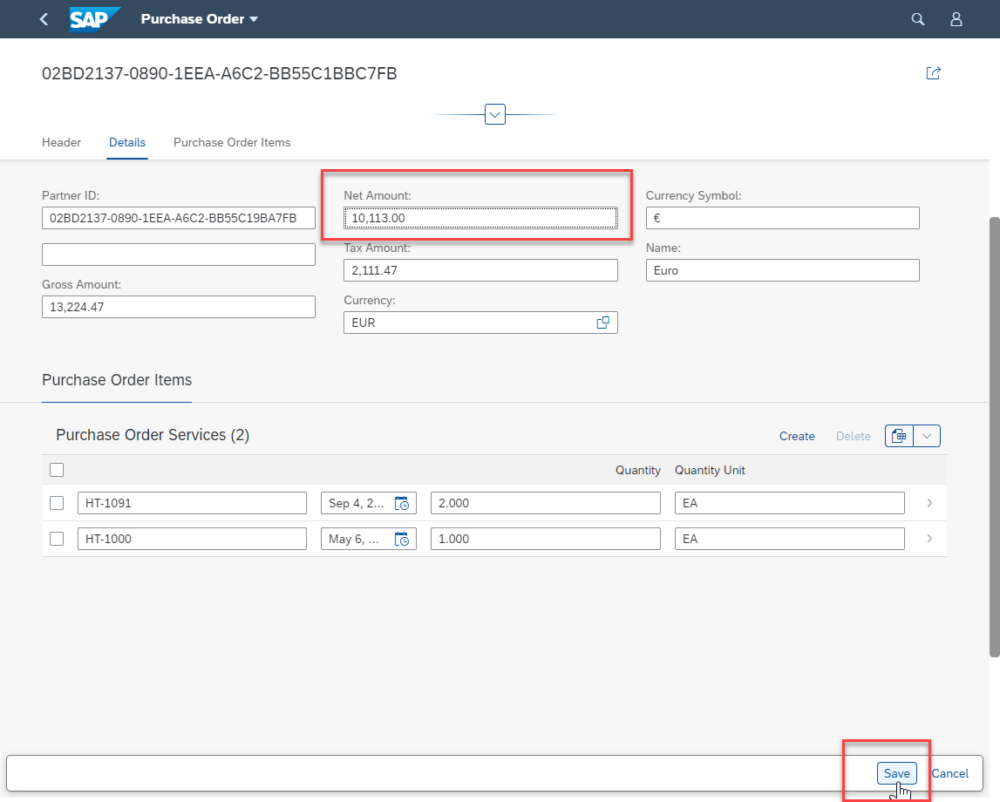

13. Return to console log.  See the event raised by our exit handler in the previous exercise</br>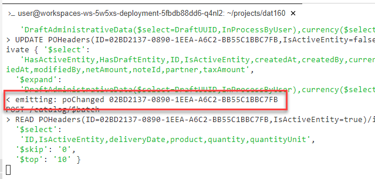

14. But this is just the generic preview generated by CDS for testing. Now let's build our own UI.

## Exercise 4.2 Setup a Fiori Launchpad Sandbox

After completing these steps you will have...

1. Create app/resources/index.html.

```html
<!DOCTYPE html>
<html>
<head>

	<meta http-equiv="X-UA-Compatible" content="IE=edge" />
	<meta http-equiv="Content-Type" content="text/html;charset=UTF-8" />
	<meta name="viewport" content="width=device-width, initial-scale=1.0" />
	<title>TechEd DAT160</title>
	<script>
		window["sap-ushell-config"] = {
			defaultRenderer: "fiori2",			
			applications: {				
				
				"odata-v4": {
					title: "Currencies",
					description: "Currencies in OData V4",
					applicationType : "URL",
					url: "/catalog/Currencies"
				},				
				"odata-v2": {
					title: "Currencies V2",
					description: "Currencies in OData V2",
					applicationType : "URL",
					url: "/v2/catalog/Currencies"
                },
				"po-fiori-preview": {
					title: "POs Preview",
					description: "POs using Fiori Preview",
					applicationType : "URL",
					url: "/$fiori-preview/CatalogService/POHeaders#preview-app"
				}  
			}
		};
	</script>

	<script src="https://sapui5.hana.ondemand.com/test-resources/sap/ushell/bootstrap/sandbox.js"></script>
	<script src="https://sapui5.hana.ondemand.com/resources/sap-ui-core.js"
    	data-sap-ui-libs="sap.m, sap.ushell, sap.collaboration, sap.ui.layout"
    	data-sap-ui-compatVersion="edge"
    	data-sap-ui-theme="sap_fiori_3_dark"
    	data-sap-ui-frameOptions="allow"
	></script>
	<script>
		sap.ui.getCore().attachInit(()=> sap.ushell.Container.createRenderer().placeAt("content"))
	</script>

</head>
<body class="sapUiBody" id="content"></body>
</html>
```

2. This is an FLP and we can configure the tiles in the applciations JSON within the file. Great for lightweight testing </br>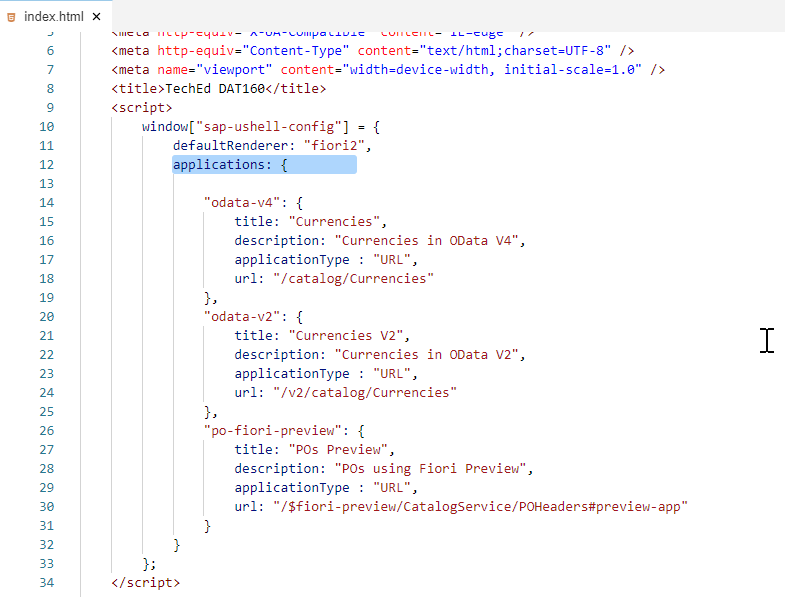

3. Save and run with ```npm start```. The preview now as a link to the launchpad. We could have also put our index.html dirctly in the app folder and then it would have replaced the CDS Preview completely.</br>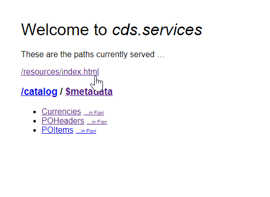

4. See the tiles you configured.  Test them all. Should open your OData services and the Fiori Preview generated by CAP same as the entry preview page. </br>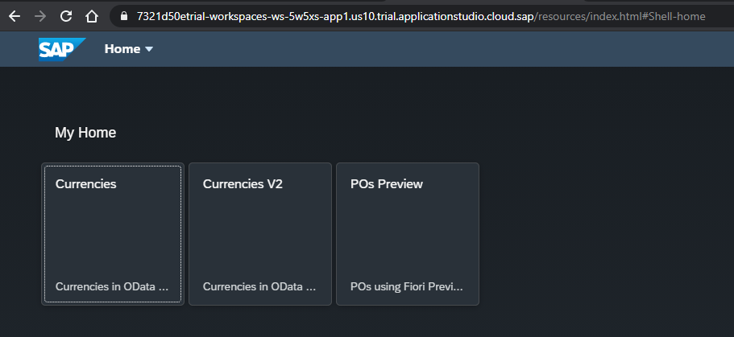

## Exercise 4.3 Generate a Fiori Application

After completing these steps you will have...

1. Open the Command Pallet </br>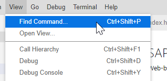

2. Run the Yeoman UI Generators command </br>

3. Choose Explore and Install Generators... </br>

4. Search for **fiori**. Choose the @sap/generator-fiori-elements and press **Install**.</br>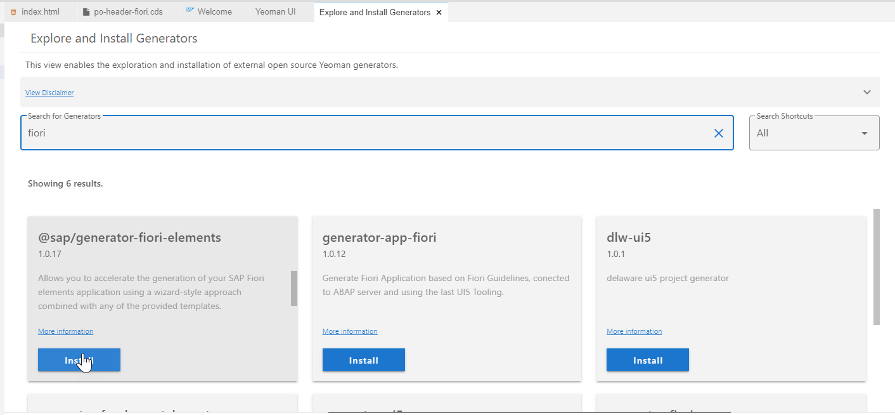

5. After installation is complete, close the tag and then reload the Yeoman UI Generators via the Command Pallet.

6. Now you will see a new Generator for SAP Fiori elements application.  Choose that and press Next. </br>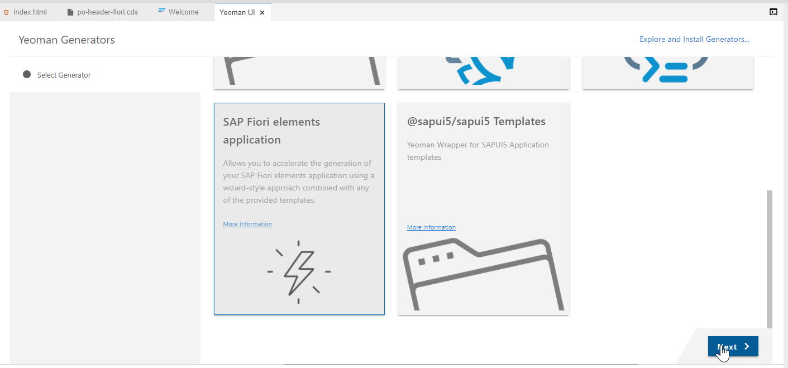

7. Choose List Report Object Page and press Next. </br>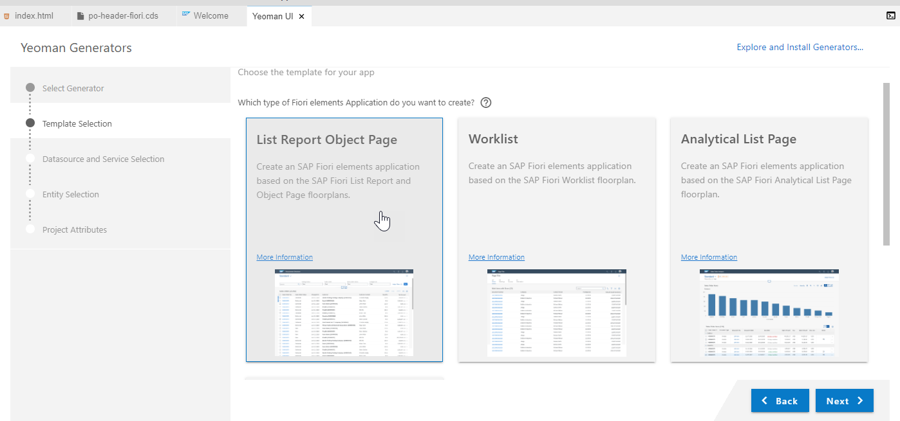

8. For the next step we will need the metadata of our the V2 version of our OData service.  Return to the tab with this servcie running. Load the metadata for the service and adjust the URL to point to the V2 version. Save the content to a file locally. </br>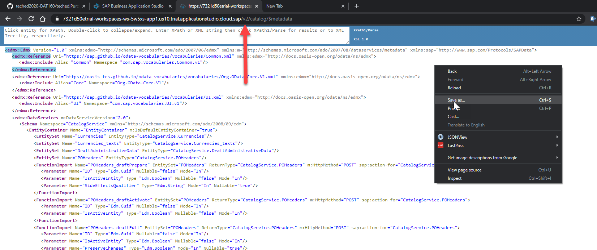

9. Now upload that metadata.xml file you just saved to the root of your project</br>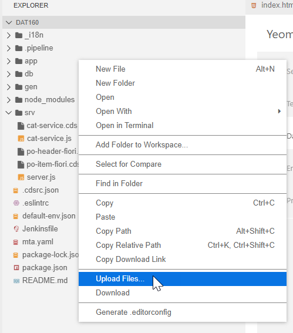

10. Returning to the Yeoman UI wizard, you should be on the Datasource and Service Selection step now.  Choose **Upload a Metadata Document** and then enter or search for the path to your project and the metadata file you just uploaded in the previous step. Finally press Next. </br>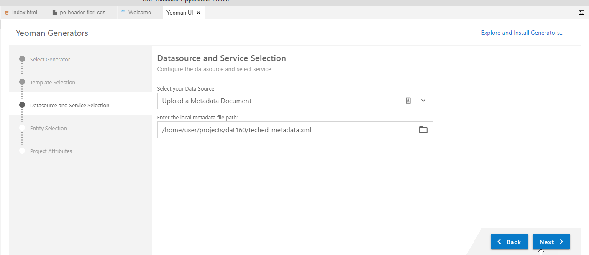

11. Choose POHeaders as your Main Entity and item as your navigation entity. Press Next. </br>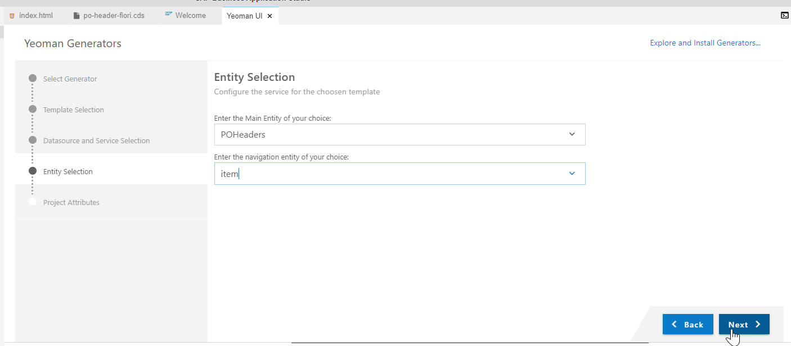

12. Fill in the following values for the Project Attributes and press Finish. </br>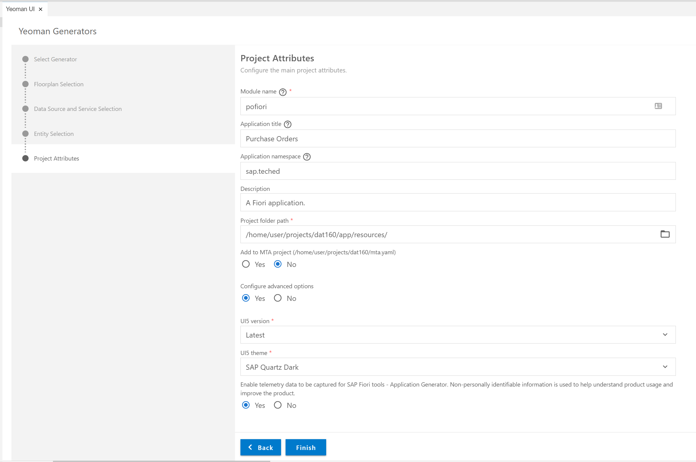

13. You have a fully generated Fiori application in your /app/resources folder. The only change you need to make is open the manifest.json file and edit the dataSources.mainService.uri. The current value of /here/goes/your/serviceurl/ needs to be changed to your actual service URL of /v2/catalog</br> 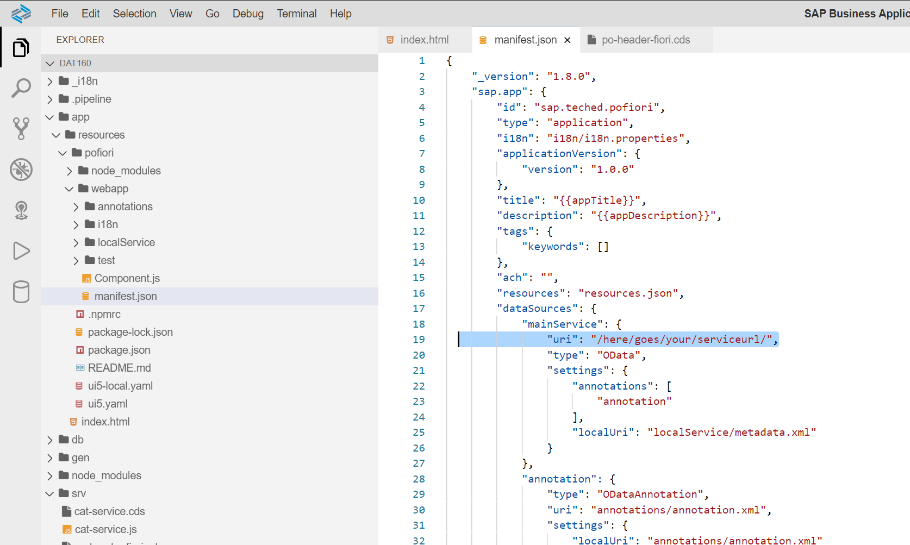</br>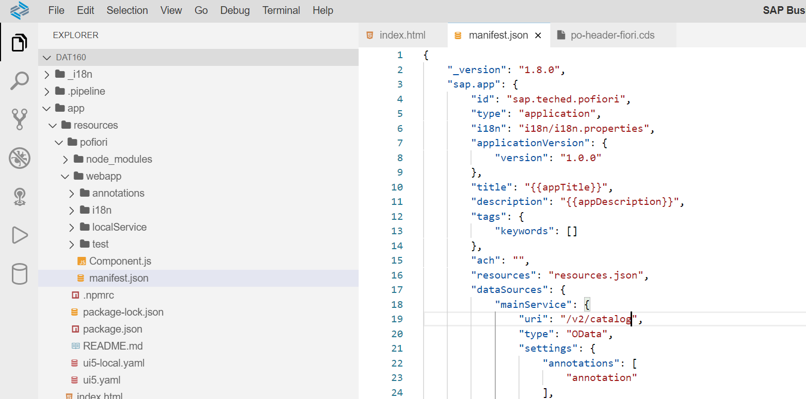

14. Return to the index.html in the /app/resources folder. Edit the Applications section to add another tile for this newly generated application. </br>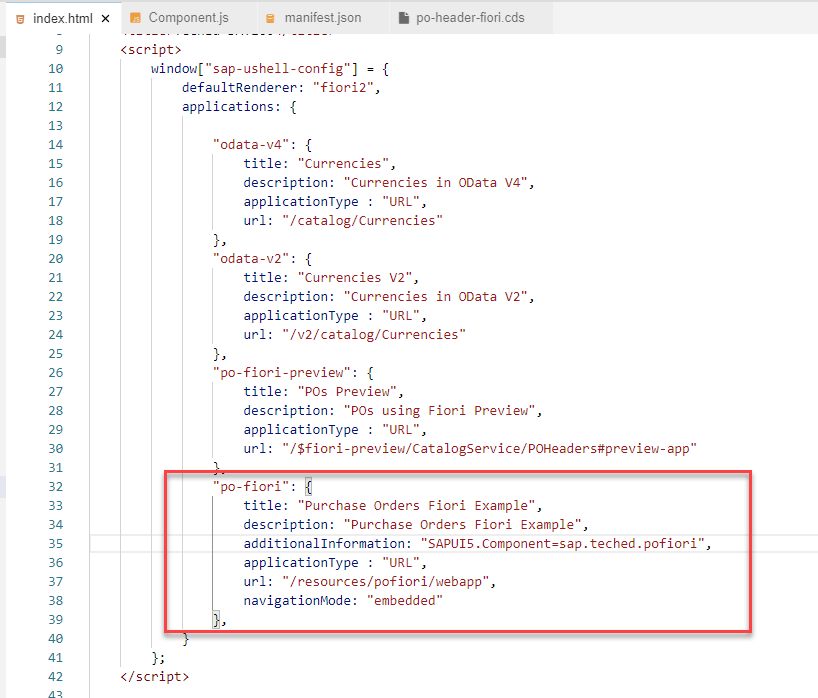

```JavaScript
        "po-fiori": {
					title: "Purchase Orders Fiori Example",
					description: "Purchase Orders Fiori Example",
					additionalInformation: "SAPUI5.Component=sap.teched.pofiori",					
                    applicationType : "URL",
					url: "/resources/pofiori/webapp",
					navigationMode: "embedded"
				},	 
```

15. Save and refresh your Fiori Launchpad Sandbox. You should see the new tile. </br>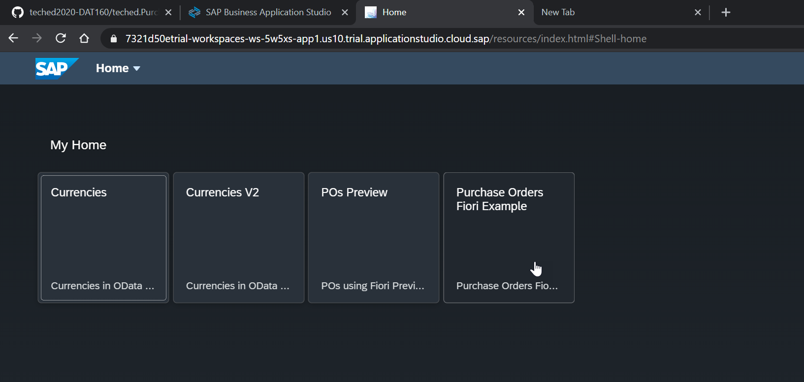

16. Click on it and you can explorer your Fiori Elements application </br>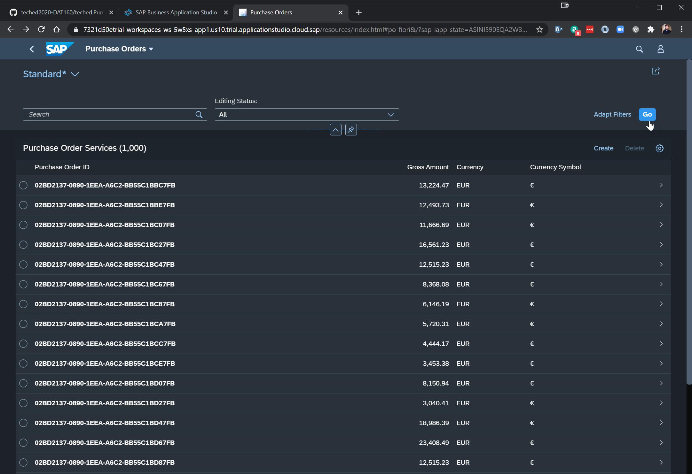

## Summary

You've now ...

Continue to - [Exercise 5 - Function Implemented as Stored Procedure](../ex5/README.md)